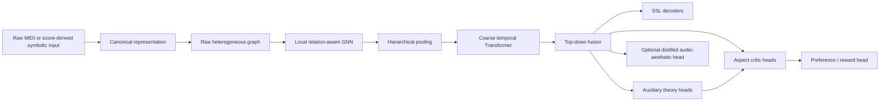

# Music Critic V2 Architecture

Status: **PROPOSED**. Phase 0 contains no model implementation.

## System flow

Predicted theory distributions may feed later critic heads only through a path
that is available and trained consistently at inference. Gold labels must never
be substituted for predictions in the deployable path.

## Raw symbolic inputs

Ordinary unlabeled MIDI is a valid mandatory inference input. Safe observations
include pitch, onset, duration, velocity, channel/program metadata, percussion
flags, tempo and meter events, track membership, and deterministic statistics.

Optional score metadata must carry availability information and be droppable.
Theory annotations are auxiliary targets rather than required encoder inputs.

## Diagnostic export boundary

`music_critic.exporters` is an output-only sibling of `music_critic.adapters`.
Adapters convert external data into validated canonical records; exporters
convert validated canonical records into diagnostic external artifacts. The
canonical MIDI exporter may depend on `mido`, but `music_critic.data` does not
import the exporter or `mido`, and graph/model/training paths do not depend on
rendering. HookTheory-specific selection remains in scripts rather than the
generic exporter.

Rendered MIDI is a consistency view of `CanonicalPiece`, not independent source
truth. Independent source checks use a separate audit script and are never
imported by production code.

## Mandatory raw-inference graph levels

- `song`
- `track`
- `bar`
- `beat`
- `onset`
- `note`

Every mandatory node and edge must be reproducible from raw symbolic evidence.
The base graph must not require gold harmonic spans, phrases, cadences, tonal
regions, or semantic track roles.

## Optional semantic predictions

The system may predict:

- harmony;
- local key or tonal region;
- phrase and section boundaries;
- cadence;
- track role;
- scale degree;
- Roman numeral;
- non-chord-tone type.

These are candidate-slot or direct-head outputs. Gold semantic nodes may exist
for supervision or analysis, but cannot be required by raw inference.

## Representation hierarchy

1. A local heterogeneous GNN models note, onset, beat, bar, and track relations.
2. Hierarchical pooling produces bar and track tokens without discarding local
   embeddings.
3. A coarse temporal Transformer models long-range bar-level development and
   cross-track structure.
4. Top-down fusion returns global context to local embeddings.
5. Separate heads perform SSL reconstruction, theory prediction, aspect
   scoring, pairwise preference, and optional aesthetic distillation.

Missing supervised targets always use explicit masks. A missing label is never
interpreted as a negative example.

## Incremental research scope

GraphMAE2-inspired decoder remasking, Hi-GMAE-inspired hierarchical masking, and
UGMAE-inspired adaptive or structural objectives are roadmap increments. They
are not all part of the bootstrap or the first baseline model.
