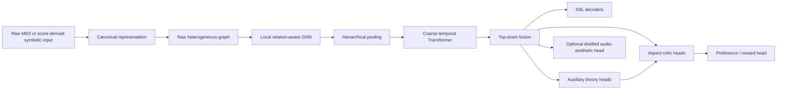

# Music Critic V2 Architecture

Status: **PROPOSED**. Phase 0 contains no model implementation.

## System flow



Predicted theory distributions may feed later critic heads only through a path
that is available and trained consistently at inference. Gold labels must never
be substituted for predictions in the deployable path.

## Raw symbolic inputs

Ordinary unlabeled MIDI is a valid mandatory inference input. Safe observations
include pitch, onset, duration, velocity, channel/program metadata, percussion
flags, tempo and meter events, track membership, and deterministic statistics.

Optional score metadata must carry availability information and be droppable.
Theory annotations are auxiliary targets rather than required encoder inputs.

Production inference is role-agnostic: melody, accompaniment, bass, chord,
voice, and staff labels are not mandatory encoder inputs. Future training and
evaluation must test track permutation/merging, metadata removal, single-track
polyphony, multitrack inputs, and unreliable or absent metadata. Track roles
may be predicted as auxiliary targets.

## Harmonic supervision and quality boundary

The accepted cross-dataset contract is specified in
[`HARMONIC_SUPERVISION.md`](HARMONIC_SUPERVISION.md). The safe shared paths are:

```text
HookTheory melody-only raw graph -> shared encoder -> harmonic predictions
POP909-CL channel-0 combined-score raw graph -> shared encoder -> harmonic predictions
```

HookTheory chord annotations and POP909-CL channel-1 chord blocks are
target-only auxiliary harmonic supervision. Direct annotations may produce
derived harmonic targets such as root, quality, pitch-class set,
bass, inversion, boundary/span, and no-chord under dataset-specific availability
masks and annotation views. Bass and inversion are separate target families
with independent masks; a joint or factorized head is a future ablation. A
derivation is safe while it remains target-only. Target-derived notes or blocks
must not affect raw canonical content, graph features/topology, raw-input
serialization, graph serialization, raw-input cache identity, graph
fingerprints, or inference.

Derived targets may be serialized in separate target, annotation, or diagnostic
artifacts with provenance. Such artifacts remain outside raw-input/graph
serialization and identity and are not production inference input.

The architecture keeps four questions separate: harmonic-semantic recognition,
melody-conditioned harmonization, likelihood of actual performed/score notes
and voicing, and preference/quality assessment. A target-only diagnostic
rendering is not actual accompaniment. Chord classifier confidence and SSL
reconstruction loss are not quality scores.

A probabilistic masked-note/pitch-set decoder and deterministic
pseudo-log-likelihood protocol are future design-and-ablation work. They are
separate from representation reconstruction and from the future
preference/quality critic.

Phases 7–8 validate SSL mechanics on bounded pre-PDMX data. Phase 10 adds the
PDMX raw-compatible projection and must enable a full-scale rerun/evaluation of
the accepted Phase 7–8 objectives before scaled SSL or later adaptive-objective
claims.

## Diagnostic export boundary

`music_critic.exporters` is an output-only sibling of `music_critic.adapters`.
Adapters convert external data into validated canonical records; exporters
convert validated canonical records into diagnostic external artifacts. The
canonical MIDI exporter may depend on `mido`, but `music_critic.data` does not
import the exporter or `mido`, and graph/model/training paths do not depend on
rendering. HookTheory-specific selection remains in scripts rather than the
generic exporter.

Rendered MIDI is a consistency view of `CanonicalPiece`, not independent source
truth. Independent source checks use a separate audit script and are never
imported by production code.

## Mandatory raw-inference graph levels

- `song`
- `track`
- `bar`
- `beat`
- `onset`
- `note`

Every mandatory node and edge must be reproducible from raw symbolic evidence.
The base graph must not require gold harmonic spans, phrases, cadences, tonal
regions, or semantic track roles.

## Phase 3A raw heterograph contract

The public builder is `music_critic.graph.build_raw_graph`. It returns PyG
`HeteroData` with canonical schema, graph schema, feature registry, and builder
versions on every graph. Graph schema `1.0.0`, feature registry `1.0.0`, and
builder `1.0.0` define the initial contract.

Node order is always `song`, `track`, `bar`, `beat`, `onset`, `note`. Onsets
are the sorted unique exact `RationalTime` values of note starts. Every beat and
onset is a raw candidate slot for later direct theory heads. Candidate slots
contain no label, boundary, class, confidence, or target availability value.

Containment uses exact half-open intervals. A note belongs to the track in its
canonical record and to the bar containing its onset. An onset belongs to the
bar and beat containing its exact time; an event at the terminal piece boundary
is owned by the final interval. Notes are not split when they sustain across a
bar, meter, or tempo boundary.

Mandatory forward relations and their explicit reverses are:

```text
song contains_track track       <-> track belongs_to_song song
song contains_bar bar           <-> bar belongs_to_song song
track contains_note note        <-> note belongs_to_track track
bar contains_beat beat          <-> beat belongs_to_bar bar
bar contains_onset onset        <-> onset belongs_to_bar bar
bar contains_note note          <-> note belongs_to_bar bar
beat contains_onset onset       <-> onset belongs_to_beat beat
onset starts_note note          <-> note in_onset onset
bar next_bar bar                <-> bar previous_bar bar
beat next_beat beat             <-> beat previous_beat beat
onset next_onset onset          <-> onset previous_onset onset
note next_in_track note         <-> note previous_in_track note
note active_at beat             <-> beat has_active_note note
```

Temporal relations follow canonical chronological order. `next_in_track`
follows canonical note order within each track, including its deterministic
pitch/duration/ID tie-breaks for equal onsets. For a positive-duration note,
`active_at` connects to every canonical beat whose start lies in the exact
half-open note interval `[onset, offset)`. Grace notes create no sustained edge.
This distinguishes starting incidence from sustained activity without creating
simultaneous-note cliques. Cross-track vertical context flows through onset and
beat nodes. Construction is output-sensitive: indexing is
`O((N + O) log B + E_active + E_graph)`, where sustained-note incidence may
itself be large for notes spanning many beats, but dense same-onset polyphony
does not create pairwise note cliques.

Model-facing inputs are separate `x_cat`, `x_cont`, `x_cat_available`, and
`x_cont_available` tensors whose columns are declared by the feature registry.
Only raw MIDI-observable or deterministic raw-derived fields are registered.
Canonical targets, target-alignment or theory annotations, dataset/source-group
identity, split, source path, provenance, confidence, and quality flags are not
read when features or topology are built. Semantic nodes are not part of graph
schema `1.0.0`.

`validate_raw_graph` defines exact global, node-store, and edge-store attribute
allowlists. Extra attributes, including labels, theory, split, provenance, and
edge labels, invalidate the graph; deterministic serialization and
fingerprinting validate first and therefore fail rather than silently omitting
them. Unavailable categorical values use a dedicated, non-colliding unknown ID
when the feature declares one, and unavailable continuous values use the
canonical `0.0` placeholder under a false availability mask. Known categorical
values outside their declared vocabulary are rejected.

`build_raw_graph` validates the complete `CanonicalPiece` by default, including
ordering and references. `assume_valid=True` is an explicit fast path only for
callers that have already obtained an error-free canonical validation report;
behavior on invalid input through that path is outside the contract. Structural
ownership and activity calculations use exact rational time. Continuous timing
is converted to `float32` only at feature-tensor construction, so feature
precision is lower than canonical structural precision.

PyTorch and PyG imports remain isolated to `music_critic.graph`, while the
current package dependency declaration installs them globally. Graph schema
`1.0.0` does not yet define batching/caching metadata or semantic prediction
stores, and sustained-note output is necessarily proportional to emitted
note/beat incidence.

## Optional semantic predictions

The system may predict:

- harmony;
- local key or tonal region;
- phrase and section boundaries;
- cadence;
- track role;
- scale degree;
- Roman numeral;
- non-chord-tone type.

These are candidate-slot or direct-head outputs. Gold semantic nodes may exist
for supervision or analysis, but cannot be required by raw inference.

## Representation hierarchy

1. A local heterogeneous GNN models note, onset, beat, bar, and track relations.
2. Hierarchical pooling produces bar and track tokens without discarding local
   embeddings.
3. A coarse temporal Transformer models long-range bar-level development and
   cross-track structure.
4. Top-down fusion returns global context to local embeddings.
5. Separate heads perform SSL reconstruction, theory prediction, aspect
   scoring, pairwise preference, and optional aesthetic distillation.

Missing supervised targets always use explicit masks. A missing label is never
interpreted as a negative example.

## Incremental research scope

GraphMAE2-inspired decoder remasking, Hi-GMAE-inspired hierarchical masking, and
UGMAE-inspired adaptive or structural objectives are roadmap increments. They
are not all part of the bootstrap or the first baseline model.
