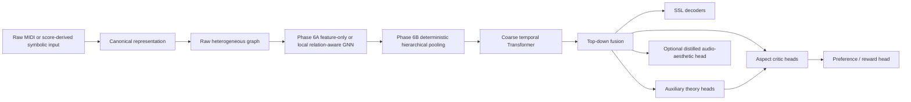

# Music Critic V2 Architecture

Status: **INCREMENTAL**. Phase 6A implements raw feature and local-GNN
representations; Phase 6B implements deterministic hierarchy, coarse
Transformer context, and top-down fusion; Phase 6C supplies reproducible
supervised execution without changing those semantics. Phase 7A adds a
deterministic GraphMAE2-inspired masked representation baseline over that
unchanged encoder. Hierarchical/adaptive SSL and critic paths remain future
phases.

## System flow


```mermaid
flowchart LR
    A[Raw MIDI or score-derived symbolic input] --> B[Canonical representation]
    B --> C[Raw heterogeneous graph]
    C --> D[Phase 6A feature-only or local relation-aware GNN]
    D --> E[Phase 6B deterministic hierarchical pooling]
    E --> F[Coarse temporal Transformer]
    F --> G[Top-down fusion]
    G --> H[SSL decoders]
    G --> I[Auxiliary theory heads]
    G --> J[Aspect critic heads]
    I --> J
    J --> K[Preference / reward head]
    G --> L[Optional distilled audio-aesthetic head]
```

Predicted theory distributions may feed later critic heads only through a path
that is available and trained consistently at inference. Gold labels must never
be substituted for predictions in the deployable path.

## Raw symbolic inputs

Ordinary unlabeled MIDI is a valid mandatory inference input. Safe observations
include pitch, onset, duration, velocity, channel/program metadata, percussion
flags, tempo and meter events, track membership, and deterministic statistics.

Optional score metadata must carry availability information and be droppable.
Theory annotations are auxiliary targets rather than required encoder inputs.

Production inference is role-agnostic: melody, accompaniment, bass, chord,
voice, and staff labels are not mandatory encoder inputs. Future training and
evaluation must test track permutation/merging, metadata removal, single-track
polyphony, multitrack inputs, and unreliable or absent metadata. Track roles
may be predicted as auxiliary targets.

## Harmonic supervision and quality boundary

The accepted cross-dataset contract is specified in
[`HARMONIC_SUPERVISION.md`](HARMONIC_SUPERVISION.md). The safe shared paths are:

```text
HookTheory melody-only raw graph -> shared encoder -> harmonic predictions
POP909-CL channel-0 combined-score raw graph -> shared encoder -> harmonic predictions
```

HookTheory chord annotations and POP909-CL channel-1 chord blocks are
target-only auxiliary harmonic supervision. Direct annotations may produce
derived harmonic targets such as root, quality, pitch-class set,
bass, inversion, boundary/span, and no-chord under dataset-specific availability
masks and annotation views. Bass and inversion are separate target families
with independent masks; a joint or factorized head is a future ablation. A
derivation is safe while it remains target-only. Target-derived notes or blocks
must not affect raw canonical content, graph features/topology, raw-input
serialization, graph serialization, raw-input cache identity, graph
fingerprints, or inference.

Derived targets may be serialized in separate target, annotation, or diagnostic
artifacts with provenance. Such artifacts remain outside raw-input/graph
serialization and identity and are not production inference input.

The architecture keeps four questions separate: harmonic-semantic recognition,
melody-conditioned harmonization, likelihood of actual performed/score notes
and voicing, and preference/quality assessment. A target-only diagnostic
rendering is not actual accompaniment. Chord classifier confidence and SSL
reconstruction loss are not quality scores.

A probabilistic masked-note/pitch-set decoder and deterministic
pseudo-log-likelihood protocol are future design-and-ablation work. They are
separate from representation reconstruction and from the future
preference/quality critic.

Phases 7–8 validate SSL mechanics on bounded pre-PDMX data. Phase 10 adds the
PDMX raw-compatible projection and must enable a full-scale rerun/evaluation of
the accepted Phase 7–8 objectives before scaled SSL or later adaptive-objective
claims.

## Diagnostic export boundary

`music_critic.exporters` is an output-only sibling of `music_critic.adapters`.
Adapters convert external data into validated canonical records; exporters
convert validated canonical records into diagnostic external artifacts. The
canonical MIDI exporter may depend on `mido`, but `music_critic.data` does not
import the exporter or `mido`, and graph/model/training paths do not depend on
rendering. HookTheory-specific selection remains in scripts rather than the
generic exporter.

Rendered MIDI is a consistency view of `CanonicalPiece`, not independent source
truth. Independent source checks use a separate audit script and are never
imported by production code.

## Mandatory raw-inference graph levels

- `song`
- `track`
- `bar`
- `beat`
- `onset`
- `note`

Every mandatory node and edge must be reproducible from raw symbolic evidence.
The base graph must not require gold harmonic spans, phrases, cadences, tonal
regions, or semantic track roles.

## Phase 3A raw heterograph contract

The public builder is `music_critic.graph.build_raw_graph`. It returns PyG
`HeteroData` with canonical schema, graph schema, feature registry, and builder
versions on every graph. Graph schema `1.0.0`, feature registry `1.0.0`, and
builder `1.0.0` define the initial contract.

Node order is always `song`, `track`, `bar`, `beat`, `onset`, `note`. Onsets
are the sorted unique exact `RationalTime` values of note starts. Every beat and
onset is a raw candidate slot for later direct theory heads. Candidate slots
contain no label, boundary, class, confidence, or target availability value.

Containment uses exact half-open intervals. A note belongs to the track in its
canonical record and to the bar containing its onset. An onset belongs to the
bar and beat containing its exact time; an event at the terminal piece boundary
is owned by the final interval. Notes are not split when they sustain across a
bar, meter, or tempo boundary.

Mandatory forward relations and their explicit reverses are:

```text
song contains_track track       <-> track belongs_to_song song
song contains_bar bar           <-> bar belongs_to_song song
track contains_note note        <-> note belongs_to_track track
bar contains_beat beat          <-> beat belongs_to_bar bar
bar contains_onset onset        <-> onset belongs_to_bar bar
bar contains_note note          <-> note belongs_to_bar bar
beat contains_onset onset       <-> onset belongs_to_beat beat
onset starts_note note          <-> note in_onset onset
bar next_bar bar                <-> bar previous_bar bar
beat next_beat beat             <-> beat previous_beat beat
onset next_onset onset          <-> onset previous_onset onset
note next_in_track note         <-> note previous_in_track note
note active_at beat             <-> beat has_active_note note
```

Temporal relations follow canonical chronological order. `next_in_track`
follows canonical note order within each track, including its deterministic
pitch/duration/ID tie-breaks for equal onsets. For a positive-duration note,
`active_at` connects to every canonical beat whose start lies in the exact
half-open note interval `[onset, offset)`. Grace notes create no sustained edge.
This distinguishes starting incidence from sustained activity without creating
simultaneous-note cliques. Cross-track vertical context flows through onset and
beat nodes. Construction is output-sensitive: indexing is
`O((N + O) log B + E_active + E_graph)`, where sustained-note incidence may
itself be large for notes spanning many beats, but dense same-onset polyphony
does not create pairwise note cliques.

Model-facing inputs are separate `x_cat`, `x_cont`, `x_cat_available`, and
`x_cont_available` tensors whose columns are declared by the feature registry.
Only raw MIDI-observable or deterministic raw-derived fields are registered.
Canonical targets, target-alignment or theory annotations, dataset/source-group
identity, split, source path, provenance, confidence, and quality flags are not
read when features or topology are built. Semantic nodes are not part of graph
schema `1.0.0`.

`validate_raw_graph` defines exact global, node-store, and edge-store attribute
allowlists. Extra attributes, including labels, theory, split, provenance, and
edge labels, invalidate the graph; deterministic serialization and
fingerprinting validate first and therefore fail rather than silently omitting
them. Unavailable categorical values use a dedicated, non-colliding unknown ID
when the feature declares one, and unavailable continuous values use the
canonical `0.0` placeholder under a false availability mask. Known categorical
values outside their declared vocabulary are rejected.

`build_raw_graph` validates the complete `CanonicalPiece` by default, including
ordering and references. `assume_valid=True` is an explicit fast path only for
callers that have already obtained an error-free canonical validation report;
behavior on invalid input through that path is outside the contract. Structural
ownership and activity calculations use exact rational time. Continuous timing
is converted to `float32` only at feature-tensor construction, so feature
precision is lower than canonical structural precision.

PyTorch and PyG imports remain isolated to `music_critic.graph` and the
Phase 5B.1 `music_critic.tasks` tensor/collator boundary, while the current
package dependency declaration installs them globally. Graph schema `1.0.0`
does not define caching metadata or semantic prediction stores, and
sustained-note output is necessarily proportional to emitted note/beat
incidence.

## Phase 5A/5B.1 target-sidecar and collation architecture

Target ontology `1.0.1` is implemented in `music_critic.tasks` and specified by
`MULTISOURCE_TARGET_CONTRACT.md`. It inventories 12 HookTheory and six
POP909-CL source-native families. No current cross-source pair is declared
exact or accepted as a lossless derived subset.

`prepare_multisource_sample` builds the Phase 3A graph from the validated
canonical piece and stores a complete graph fingerprint in the immutable
`MultiSourceSample` sidecar. The external-graph factory proves equality to a
fresh canonical projection and exposes no verification bypass. The collator
recomputes the fingerprint to reject feature or topology mutation after
preparation. Graph-free `MultiSourceTargetProjection` is used only for target
inventory audits. No binding is stored in PyG.

Phase 5B.1 implements indexed exact alignment, target encoding registry
`1.0.0`, tensorization, and production collation. The PyG batch remains
raw-only; target values and alignment indices never enter graph global, node,
or edge stores. A batch-aware validator adapts
the exact Phase 3A allowlists to normal PyG collation: only node-level `batch`
and `ptr` are additionally allowed, version/raw-only metadata is checked per
source graph, and combined shapes, offsets, endpoints, and reconstructed
graphs must remain valid. Local target indices become typed global indices
through PyG `ptr` and are checked against the typed `batch` vector. HookTheory
retains melody-conditioned supervision, POP909-CL retains score-conditioned
recognition, and raw MIDI may have an entirely empty target bundle.

One immutable per-piece `AlignmentIndex` provides O(1) note/annotation and
exact-time mappings plus sorted rational onset/beat/bar candidates. Half-open
span lookup uses bisect. Because index construction sorts temporal candidates,
strict alignment complexity is `O(P + C log C + T log C + R + F*C)`, where
fixed-registry `F*C` is linear in candidate count; no source-entry loop repeats
complete index construction or candidate scans. Alignment policies remain
task-declarative and exact: note identity; half-open containment of onset
points and beat/bar start anchors; exact span-start boundary events; and
explicitly available coverage spans. Every aligned index has an explicit node
type. Equal multi-span values merge, conflicts are masked with a stable
diagnostic, and unmatched boundary events are retained with a masked index
rather than snapped. POP909-CL boundary event detection and no-chord coverage
detection are distinct positive-unlabeled tasks. The former defines no
synthetic `absent`; the latter has only explicit positive `N` spans and defines
no synthetic `not_N` from chord spans, uncovered candidates, or absent
annotations. Masked, absent, ambiguous, unsupported, trailing-uncovered, and
available no-chord states remain distinct.

Grouping resolves authoritative lineage from provenance, using the canonical
source group only as an explicit fallback. Any override is an equality
assertion. Ordering operates on atomic transitive components connected by
source or lineage and is seeded and input-order invariant. Split safety is
checked on those same transitive components, including paths bridged by an
unassigned `split=None` record, and every dataset piece has one assignment.

Closed categorical sidecars use ontology-order `torch.long` indices with
masked sentinel `-1`; closed multilabel sidecars use `torch.bool [N, C]`.
Open strings remain lossless CPU tuples and are explicitly not model-ready.
Encoding metadata selects only a value representation, not a loss.
`supervision_regime` distinguishes fully supervised, positive-unlabeled, and
deferred open-vocabulary semantics. Source availability, successful entity
alignment, and model readiness jointly define future supervision eligibility.
Eligibility only routes a row to a future task-specific objective; it does not
turn either PU task into fully-supervised classification. Concrete losses are
Phase 6 decisions.
Deterministic CPU statistics distinguish model-encodable from
supervision-eligible rows and separately count masked, unaligned, conflict,
and deferred rows.

## Phase 5B.2 corpus and loading architecture

Phase 5B.2 adds versioned portable corpus index/cache contracts without
changing canonical, graph, adapter, ontology, or encoding semantics. Offline
HookTheory and POP909-CL builders serialize one deterministic canonical JSON
artifact per accepted source. Cache identity binds source content,
adapter/config, canonical schema, ontology semantics, and cache version;
artifact identity additionally binds canonical payload SHA-256. Cache writes
are atomic, partial files are invalid, and stale namespaces are retained.
Graphs and tensors are never cached.

`IndexedMultiSourceDataset` loads index metadata only. Each item reads and
verifies exactly one artifact, validates it, and invokes
`prepare_multisource_sample`. Canonical source grouping, prepared
dataset/piece/source/lineage identity, and recomputed target availability must
equal the freshly fingerprinted index sidecars or loading fails closed. None
of those sidecars enter graph stores. A pickle restoration path reinstates the
private canonical/raw binding token and revalidates the graph fingerprint, so
spawn workers do not weaken Phase 5B.1.

Splits are external versioned `SplitManifest` values bound to the exact
complete constituent index set and transitive source/lineage component
fingerprints across corpus boundaries. `MultiCorpusDataset` validates one
global manifest against all indices before deriving any view; separately
validated per-corpus manifests cannot be composed. Every derived view binds
manifest, split, its corpus index, and exact ordered record membership.
Source-provided split is only `suggested_split`; no Dataset applies it
implicitly. The optional group-hash planner is target-blind and requires
explicit fixture/user seed and ratios. No production split is selected in
this phase.

POP909-CL runtime adapter `2.0.0` separates source-record identity
(`piece:pop909-cl-<song-id>`), target-independent score-only equivalence
(`source_group_id`), and cross-corpus song lineage (`lineage_group_id`).
Canonical serialization and strict `graph_fingerprint` preserve every entity
ID and bind an exact canonical piece to its raw graph. Versioned
`model_input_fingerprint@1.0.0` excludes entity IDs and hashes only validated
schema/feature/builder metadata, ordered feature names and tensors,
availability, candidate slots, and ordered topology. Target-bundle identity
remains a separate sidecar. The authoritative split-equivalence identity is
the score-only `source_group_id`, never either graph fingerprint. The
unchanged transitive source/lineage algorithm therefore keeps exact score
duplicates split-atomic without collapsing distinct target observations.

`MultiCorpusDataset` composes one globally validated split in stable dataset-ID
order. Its versioned composition fingerprint commits to the global manifest,
constituent indices, and ordered membership of every view.
The quota sampler uses explicit positive weights, largest-remainder epoch
quotas, and local torch generators for dataset schedules and shuffled local
cycles. Epoch evidence carries the composition identity, and the schedule
fingerprint hashes resolved `(dataset_id, piece_id)` identities plus sampler
version, seed, epoch, weights, and quotas rather than transient global
offsets. Epoch replay is deterministic and target-independent. The DataLoader
factory uses the existing Phase 5B.1 collator and top-level Python/torch worker
seeding. Worker parity covers complete raw graphs and all target/CPU sidecars
and deterministic statistics. HookTheory corpus building quarantines only
`HookTheoryAdapterError`; unexpected failures abort without publishing a
successful index/report. All cache, split, sampling, and worker diagnostics
remain CPU-side; models and losses remain outside Phase 5B.2.

## Optional semantic predictions

The system may predict:

- harmony;
- local key or tonal region;
- phrase and section boundaries;
- cadence;
- track role;
- scale degree;
- Roman numeral;
- non-chord-tone type.

These are candidate-slot or direct-head outputs. Gold semantic nodes may exist
for supervision or analysis, but cannot be required by raw inference.

## Representation hierarchy

1. Phase 6A encodes every raw feature store and optionally applies a shallow
   relation-specific local heterogeneous GNN over every Phase 3A relation.
   Its versioned output retains feature-scale, optional per-layer, and final
   one-row-per-node representations plus batch membership. Source-native heads
   emit logits for every allowed raw candidate before targets are joined for
   loss; raw-only inference therefore uses the same candidate path. Target
   replacement, deletion, masking, or addition cannot change candidate
   identity or eval logits. No head is global-mean-only.
2. Phase 6B validates exact ownership from raw forward/reverse hierarchy edges.
   Sparse family pooling produces bar tokens from own+beat+onset+note evidence
   and track tokens from own+note evidence. Mean, maximum, log-count, explicit
   availability, learned projection, and parent residual are retained without
   a dense membership matrix or child-by-parent tensor.
   Store existence and `edge_index` presence are checked before PyG indexing,
   so structured failures cannot create missing stores. Externally supplied
   ownership is compared exactly with raw relations and local membership; the
   standard model path scans raw ownership once.
3. One padded sequence per sample is `[SONG] + bars + tracks`, with separate
   type embeddings, runtime ordinal positions, and a key-padding mask. A
   batch-first pre-norm Transformer returns contextual song/bar/track rows
   without cross-sample attention. The SONG row is a representation, not a
   quality score. Counts, family ordinals, and positions are tensorized; coarse
   packing has no per-row host synchronization and performs one batch-level
   synchronization only to allocate `max(L_s)` padding.
4. Gated top-down residual fusion returns contextual bar+track+song to notes,
   bar+song to onsets/beats, contextual parent+song to bars/tracks, and
   contextual song to song while retaining all local rows.
5. Separate heads perform SSL reconstruction, theory prediction, aspect
   scoring, pairwise preference, and optional aesthetic distillation.

Missing supervised targets always use explicit masks. A missing label is never
interpreted as a negative example.

Phase 6A implements only visible-input local reconstruction as a plumbing
check and fully supervised auxiliary semantics. Phase 6B adds global context
without changing that reconstruction or using mean-only final aggregation.
Phase 7A adds GraphMAE2-inspired masked representation learning, while future
critic evidence must retain local or top-k worst regions.

Phase 6A model/output and loss contracts are `1.1.0`; candidate prediction is
`1.0.0`. Tensor node-type codes in `BatchTarget` contract `1.1.0` permit the
candidate join and task/node-type/sample reductions to stay tensorized, with
Python work bounded by the fixed task/node-family registry. Checkpoints
`1.1.0` validate metadata and complete model/optimizer structure before an
atomic state application; saves use atomic same-directory replacement.
Canonical one-note sensitivity rebuilds and validates both graphs. Its
oversmoothing statistic is separate per sample/node type/scale, unavailable
below two nodes, and exact linear `O(ND)`.

Phase 6B pooling, coarse-sequence, hierarchical-output, top-down-fusion,
hierarchical-model/output, and hierarchical-checkpoint contracts are each
`1.0.0`. Phase 6A versions remain unchanged. The full additive contract is in
`PHASE6B_HIERARCHY.md`.

## Phase 6C training boundary

Hydra structured configuration selects only the existing feature-only,
local-GNN, or hierarchical model and the existing bounded or versioned-cache
data paths. Fully resolved configuration is an artifact and participates in
training-checkpoint compatibility. The harness adds no model feature, head,
loss, target family, graph relation, or cache field.

The official `MultiSourceBatch` transfer deep-copies the raw PyG batch and
moves its tensor attributes plus every model-facing target tensor. It preserves
tuple/string metadata and keeps provenance, diagnostics, statistics, and other
CPU sidecars off device. The original batch is not mutated and targets never
enter graph stores. Fixed task/node-family tensor checks prove device, shape,
task ordering, and graph binding without replaying row-wise Python validation
on CUDA.

Runtime device resolution is shared by training, evaluation, and SSL. CPU
canonicalizes to bare `cpu`; bare CUDA resolves to the current concrete index;
and explicit `cuda:N` preserves its index only when
`0 <= N < torch.cuda.device_count()`. The current index is checked against the
same visible count. Unavailable CUDA is a structured contract failure, while
an invisible explicit or current index fails before tensor transfer as
`runtime.device.cuda_index_out_of_range`, with requested device and visible
count evidence. Training, evaluation, and SSL accept `cpu`, `cuda`, `cuda:N`,
and `auto` through this resolver rather than subsystem allowlists. AMP is
eligible only when the resolved device type is CUDA. Transfer validation
compares exact devices, never only `device.type`, because `cuda:0` and
`cuda:1` are different placement boundaries. Runtime resolution contract
`1.0.1` and device-transfer contract `1.0.2` record these patch-level rules.

One-batch mode repeats exactly one bounded or first real cached train batch,
reports harmonic/reconstruction/total losses, finite gradients, clipping,
candidate counts, and gradient coverage, then requires both active objectives
to decrease and a checkpoint reload to reproduce eval logits bit-exactly.
This is plumbing evidence rather than generalization.

Multi-epoch mode composes the existing global split, lazy datasets,
deterministic quota sampler, and production collator. Only training membership
is epoch-dependent. Validation is a fixed, fingerprinted, no-replacement full
view by default or one fixed bounded subset. Per-task and per-dataset epoch
metrics accumulate loss numerators and exact eligible-row denominators, so the
explicitly weighted objective is independent of batch partitioning within a
documented floating-point tolerance. Each batch reduces to
dataset/task-or-field scalars, performs at most one packed device-to-host
transfer, and folds into bounded CPU buckets; no prior-batch tensor view is
retained. Persistent device metric memory is zero, while CPU aggregate storage
is `O(dataset_count * task_or_field_count)`. The supervised preset uses LR
`3e-4` and no reconstruction; joint visible reconstruction is a named
ablation.

Training checkpoints bind resolved objective/configuration,
data/index/split/composition fingerprints, and existing model contracts. They
contain optimizer, scheduler, scaler, epoch, best fixed-validation metric,
committed metric-row count, and Python/torch RNG states. Loading is
failure-atomic across every live state. Atomic per-epoch records plus the
checkpoint row count make `metrics.jsonl`/`last.pt` crash-consistent. Resume is
deterministic only at an epoch boundary; mid-epoch resume is intentionally not
implemented.

Fresh runs reject managed-artifact collisions unless explicit overwrite is
enabled; overwrite removes only the known managed set. A versioned run
manifest binds evidence artifacts and the checkpoint contract. Resume
validates this manifest and `next_epoch <= configured epochs` before live-state
mutation or artifact/journal writes.

Normal CUDA training validates semantic binding on CPU. The engine/device hot
path has no tensor-to-Python conversion, and joint reconstruction has no
per-feature-family data-dependent host predicate. Metrics perform one explicit
packed transfer per non-empty batch; reports expose actual transfer and
retained-storage counters. Full gradient evidence remains a one-batch or
explicit diagnostic operation. Epoch rows distinguish
`learning_rate_used` from post-scheduler `next_learning_rate`. Commands and
artifact semantics are in `TRAINING.md`.

## Phase 6D-A evaluation boundary

Evaluation reconstructs a fresh feature-only, local-GNN, or hierarchical model
from the checkpoint's complete model contract and loads only `model_state`.
It validates the contract against current canonical/graph/feature/ontology/
encoding/head metadata before applying weights. Phase 6C data bindings are
matched to the selected index, split manifest, train/evaluation composition,
and fixed validation membership. Each selected cached piece is still checked
against its index-bound canonical SHA-256 while loading. Older Phase 6A/6B
model-only checkpoints remain evaluable, but their lack of historical
Phase 6C data binding is reported rather than silently claimed as verified.
Optimizer, scheduler, scaler, checkpoint RNG, and caller RNG are not applied.

The inference boundary is candidate-first:

```text
raw graph -> encoder + source-native candidate logits
          -> target-sidecar join
          -> eligible-row streaming metrics
```

Targets are unavailable to `predict`. The later join admits only available,
aligned, fully supervised rows; conflict rows are unavailable by construction.
Metrics are keyed by exact `(dataset_id, task_id)`, and a task is admitted only
for its ontology-declared source adapter. HookTheory and POP909-CL heads
therefore never share a bucket or macro average. Streaming accumulators retain
fixed confusion/TP/FP/FN/TN and exact binary64 likelihood sums, not prediction
tensors.

Per-class F1 is computed directly from confusion counts as
`2 TP / (2 TP + FP + FN)`. It is undefined only when that denominator is zero;
supported-but-unpredicted and unsupported-with-false-positive classes have
defined F1 zero and remain in macro-F1. Versioned task macro summaries preserve
the complete dataset/task evidence and group only by exact dataset plus
encoding kind. They average defined normalized task metrics without task
weights, count excluded undefined tasks, and omit cross-vocabulary NLL/BCE and
other scientifically incomparable aggregates with explicit reasons.

Trivial baselines are constructed in a separate pass over the train split
only. Their artifact binds train membership, index/cache/split, ontology, and
encoding evidence. Held-out labels are joined only after fixed majority,
empirical-prior, prevalence, and 0.5-threshold decisions exist. Undefined
metrics use JSON `null` plus a stable category and explanation.

Detailed timing is a separate, explicitly enabled, bounded profiler with
synthetic plumbing and an optional indexed production-read-only subset.
For `workers=0`, its exclusive preparation chain passes canonical artifacts to
graph construction, then target alignment/tensorization, then assembly without
repeating alignment. Prepared-batch compute, validation compute, loader-only
traversal, and loader-plus-training end-to-end throughput are distinct passes.
Multiprocess startup/IPC/prefetch attribution is reported as unavailable
rather than assigned to collation, and RSS is a process high-water mark.
Normal training contains no per-batch timing histories or CUDA synchronization.
Per-epoch train/validation wall time and throughput live in the non-binding
`epoch_performance.jsonl` sidecar. The deterministic `metrics.jsonl` journal
and checkpoint contract remain byte-exact across epoch-boundary resume.
The complete contract is in `EVALUATION.md`.

## Phase 7A masked representation boundary

Phase 7A consumes an immutable raw-only `SSLBatch` containing the PyG batch,
dataset/piece identities used only for deterministic plan derivation, and
aggregate sample/node/edge counts. It strips Phase 6 target sidecars without
reading their contents for bounded compatibility. Production cache execution
uses a dedicated raw-only dataset/collator around `load_cached_piece` and
`build_raw_graph`; it never projects a supervised target bundle. Both paths
retain the existing group-safe train and fixed-validation membership. The raw
graph schema, stores, topology, serialization, fingerprint, index/cache keys,
and supervised model outputs are unchanged.

Every mask plan used by the model is prepared from a fully validated CPU
`SSLBatch` before device transfer. Prepared binding contract `1.1.0` binds the
ordered dataset/piece identities, raw structure and ownership, stage,
canonicalized epoch, seed, and exact plan fingerprints. Preparation is
failure-closed: a caller-supplied binding is accepted only when all bound
values match the validated CPU batch and regenerated plans. The binding is a
runtime sidecar; it is not inserted into graph stores and does not change graph
serialization, cache identity, or raw-graph fingerprints.

The process-local runtime descriptor binds the graph and every store by strong
reference, identity, and type; ordered node and edge types; and exact
global/node/edge attribute sets. It retains strong references and expected
object identity, `_version`, shape, dtype, and device for all 65 graph tensors:
global `raw_only`; `x_cat`, `x_cat_available`, `x_cont`,
`x_cont_available`, `batch`, and `ptr` on every mandatory node store;
beat/onset `candidate_slot`; and every mandatory `edge_index`. The selected
note-index tensor is attested separately. A typed hash covers all non-tensor
metadata, including `num_nodes`, feature-name collections, and every
`entity_id` collection.

Transfer revalidates the CPU source, deep-copies the full store surface, moves
tensor attributes, checks the transferred metadata/shape/dtype/device surface,
and renews the complete descriptor over the moved objects. The source
descriptor cannot authorize the moved graph. Object identities, references,
version counters, devices, private HMACs, and opaque tokens are deliberately
excluded from deterministic fingerprints, serialization, caches, checkpoints,
and reports.

The transfer receives the same concrete runtime device as the Phase 6C and
evaluation boundaries. The selected-note-index binding sidecar is moved to and
validated against that exact device. A mismatch retains
`ssl.data.device_transfer_tensor_mismatch` and identifies the global, node,
edge, or binding field together with concrete expected and actual devices.

The public Phase 6 raw encoder and model `forward`/`encode` paths have no
boolean validation bypass and always run the established full graph validator.
The internal prepared encoder requires a process-local opaque token bound to
one batch, graph, binding, attestation, and mask rate. Full-target and
masked-online execution each obtain and re-attest a token immediately before
encoder work. CPU and CUDA use this same path without post-transfer
graph-tensor `.cpu()`, `.tolist()`, or `.item()` calls. Plan preparation time
is reported separately from device transfer and model compute. Plan semantics
remain independent of batch partition/order and worker scheduling.

Maskable-field registry `1.0.0` resolves names against raw feature registry
`1.0.0`. Its only group, `note_pitch_group`, masks note `pitch`,
`pitch_class`, `octave`, and `track_relative_pitch`, plus each field's
availability contribution. Every selected note projects a collateral mask to
every unselected note peer in the same affected owner track for
`track_relative_pitch`, and to the owner track for `mean_pitch`, `pitch_std`,
`min_pitch`, and `max_pitch`, always including availability. Peer-note and
owner-track collateral fields close redundant pitch leakage but are not
reconstruction targets. The registry fingerprint is
`97836b2adb610529994ae609e89913eb6b21ad0f07d4bf695c911251d5f8ac85`.

Immutable per-sample MaskPlans use policy
`uniform_note_without_replacement@1.0.0`. Portable SHA-256 derivation binds
global seed, train/validation stage, `(dataset_id, piece_id)`, epoch, and view
index without Python `hash()` or global RNG. Train plans change
deterministically by epoch when possible; validation uses canonical epoch
zero. Selection is independent of targets, annotations, batch order, and
worker count.

The overlay acts only inside raw feature encoding. At any primary or collateral
semantic field/row it substitutes a learned SSL mask token for the value
contribution and zero for the availability contribution. No raw tensor is
mutated. With no overlay, the Phase 6 two-addition order and state-dict surface
are unchanged.

Target mode is `shared_stop_gradient_full_view`: the shared hierarchical
encoder runs on the complete raw view under eval/no-grad to produce detached
note, bar, and song targets. The online path runs the same architecture with
the feature overlay. There is no EMA target encoder. Selected online note rows
pass through deterministic latent decoder re-mask views and a contextual
representation decoder. Context mode
`online_owner_track_bar_song_temporal_neighbors` combines only masked-online
owner-track, available owner-bar, song, and previous/next in-track note
representations. Adding it after latent re-masking prevents a fully re-masked
view from reducing every prediction to the same learned mask token. All online
bar and song rows pass through separate projector/predictors.

Every component uses row-wise `1 - cosine` with contract-fixed `eps=1e-8` and
`sum_count_mean` reduction. Prediction and detached target must have identical
shape and concrete device and must both be floating-point. Any pair drawn from
FP16, BF16, and FP32 is cast out of place and computed in FP32 with autocast
disabled; only a matching FP64 pair retains FP64. Mixed FP64 or unsupported
floating combinations are rejected. The FP32 prediction cast preserves
gradient flow, while the target remains stop-gradient. Empty differentiable
numerators, ordinary numerators, means, multi-view reduction, and the combined
SSL objective follow the same compute-dtype rule. Numerator, denominator,
mean, zero-norm count, and unavailable reason remain explicit. Zero-vector
rows are counted, and a positively weighted component with no eligible rows
makes total SSL loss unavailable.

Anti-collapse diagnostics contract `1.1.1` applies the same compatible
compute-dtype normalization before accumulating target and prediction rows
separately for note, bar, and song over the complete train/validation stage.
For each side and level it reports row count, embedding dimension, the contract
variance formula, mean L2 norm, zero-norm count, and global mean off-diagonal
cosine; fewer than two rows produce a structured unavailable result. Mergeable
`O(D)` sufficient statistics retain no embedding history or production
pairwise matrix and reproduce the dense stage-level formula independently of
batch partition, batch order, and worker count. The artifact field is
`anti_collapse_aggregate`; the former `anti_collapse_last_batch` snapshot is
not an acceptance statistic.

The `O(D)` statement is limited to retained accumulator state. The current
`from_values` reduction allocates float64 `N x D` `values64` and normalized
`N x D` working temporaries; no `O(D)` peak-temporary-memory property is
claimed. Their real CUDA cost remains unmeasured. Production SSL on an RTX
3090 is gated on a separate profiler and any required optimization.

The simple decoder mode is one view with no latent remasking. The Phase 7A
main preset is three views with probability `0.20`; no relative-performance
claim is made. Both use mask rate `0.30` by default. Separate note, bar, and
song weights remain configurable. For the Phase 7A one-batch experiment, an
unset optimizer learning rate resolves to `3e-4`; an explicit caller override
remains authoritative. This avoids inheriting the generic supervised
one-batch rate while leaving every Phase 6 preset unchanged.

The bounded acceptance source is a deterministic multi-piece, multi-note
canonical fixture with disjoint train/validation identities and explicit
multitrack and multibar cases. Its pitch/rhythm variation makes mask rate
`0.30` select multiple primary note rows and exercise nonzero peer-note and
owner-track collateral masks. One-batch acceptance remains a plumbing
experiment: after fitting, a coherent canonical pitch mutation rebuilds the raw
graph and all dependent raw features while preserving the fixed MaskPlan. The
versioned `midi_axis_reflection_v1` policy maps `pitch -> 127 - pitch` and binds
the rebuilt source to actual runtime graph fingerprints. The evidence reports
cosine to the correct target, cosine to the mutated target,
their signed margin, and correct-to-mutated target distance. Report contract
`1.2.2` exposes two independent, fingerprinted subcontracts. No-leakage
`1.0.0` accepts only strict raw/source/plan/binding/online bit-exact invariants,
an applicable changed hidden target, and finite metrics. Pitch-sensitive
reconstruction `1.0.0` accepts an applicable mutation that changes the hidden
target and reconstruction loss with positive target distance and finite
metrics. Correct-target preference is a sign-agnostic training diagnostic, not
a two-step plumbing acceptance criterion. Cosine, L2, signed margin, and
floors compute in FP32 with autocast disabled regardless of prediction source
dtype. These are representation-sensitivity diagnostics, not labels,
cross-entropy, probabilities, likelihood, or PLL.

Held-out execution evaluates the fixed, disjoint validation membership once
before any optimizer step and after every training epoch. Epoch rows retain
train and validation loss plus the exact stage-wide diagnostics. Best
checkpoint selection uses only fixed-validation loss; the initial validation
baseline, memberships, prepared-plan bindings, and deterministic metric rows
are rerun evidence. Non-collapse acceptance requires finite initial and final
note/bar/song aggregates, no zero vectors, nondegenerate variance/norm, and
embeddings that are not all near-identical. These checks validate bounded
mechanics, not generalization or scaled effectiveness.

Umbrella SSL `1.2.2` requires the indexed runtime-device and AMP-safe numerical
boundaries, while SSL model/output remain `1.2.0` at unchanged architecture
and output schema. Representation loss, multi-view loss, and the combined SSL
objective are `1.0.1`; anti-collapse diagnostics are `1.1.1`. Checkpoint,
epoch-journal, metric-row, run-manifest, and performance-row contracts remain
`1.2.0`; training report `1.2.2` exposes concrete `cuda:N` and the two
independent evidence objects. The performance row separates CPU plan
preparation from transfer/compute. MaskPlan, mask policy, maskable-field
registry, representation target, decoder, and encoder-export semantics remain
`1.0.0`; prepared binding remains `1.1.0`.

SSL checkpoint `1.2.0` binds the model/SSL contracts, field-registry
fingerprint, resolved config, data index/split/composition/fixed-validation
fingerprints, optimizer/scheduler/scaler, RNG, and ordered epoch journal.
Save/load is atomic and resume is epoch-boundary-only. Encoder export `1.0.0`
strictly transfers the local encoder, hierarchy pooling, Transformer, and
fusion parameters into a compatible supervised hierarchical model without
overwriting task or reconstruction heads.

Run reports keep four claim boundaries explicit: one-batch plumbing; bounded
held-out/non-collapse evidence; named production-cache execution; and
production/full-corpus SSL training. The first two establish only deterministic
mechanics. Reading a production cache does not establish production training,
and no Phase 7A bounded result establishes a full-corpus claim.

The full Phase 7A contract and its bounded-science/non-claim boundary are in
`PHASE7A_SSL_BASELINE.md`.

## Incremental research scope

Phase 7A implements GraphMAE2-inspired decoder remasking but is not a faithful
GraphMAE2 reproduction. Hi-GMAE-inspired hierarchical masking and
UGMAE-inspired adaptive or structural objectives remain roadmap increments.
They are not part of the Phase 7A baseline. PDMX-scale effectiveness must be
evaluated after the Phase 10 raw-compatible corpus projection; PLL and
critic/quality scoring remain separate future contracts.
