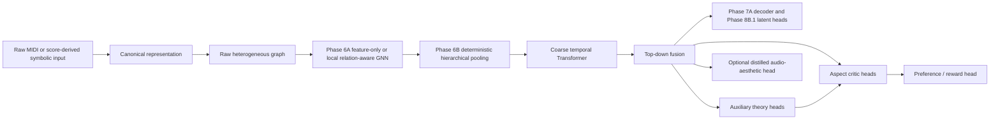

# Music Critic V2 Architecture

Status: **INCREMENTAL**. Phase 6A implements raw feature and local-GNN
representations; Phase 6B implements deterministic hierarchy, coarse
Transformer context, and top-down fusion; Phase 6C supplies reproducible
supervised execution without changing those semantics. Phase 7A adds a
deterministic GraphMAE2-inspired masked representation baseline over that
unchanged encoder. Phase 8A adds deterministic hierarchy-aware mask planning
and views over the same encoder/security boundary. Phase 8B.1 adds
independently ablatable onset/beat/bar/track recovery objectives. Phase 8B.2A
adds the reproducible comparison/transfer control plane; scaled scientific
evidence, adaptive SSL, and critic paths remain future work.

Phase 9C-D adapts the verified Phase 9C-B checkpoint envelope into the shared
Phase 9C-C stateful continuation boundary. Decoder kind and parent layout are
bindings; training, telemetry, checkpoint and resume remain decoder-neutral.

## System flow


```mermaid
flowchart LR
    A[Raw MIDI or score-derived symbolic input] --> B[Canonical representation]
    B --> C[Raw heterogeneous graph]
    C --> D[Phase 6A feature-only or local relation-aware GNN]
    D --> E[Phase 6B deterministic hierarchical pooling]
    E --> F[Coarse temporal Transformer]
    F --> G[Top-down fusion]
    G --> H[Phase 7A decoder and Phase 8B.1 latent heads]
    G --> I[Auxiliary theory heads]
    G --> J[Aspect critic heads]
    I --> J
    J --> K[Preference / reward head]
    G --> L[Optional distilled audio-aesthetic head]
```

Predicted theory distributions may feed later critic heads only through a path
that is available and trained consistently at inference. Gold labels must never
be substituted for predictions in the deployable path.

## Raw symbolic inputs

Ordinary unlabeled MIDI is a valid mandatory inference input. Safe observations
include pitch, onset, duration, velocity, channel/program metadata, percussion
flags, tempo and meter events, track membership, and deterministic statistics.

Optional score metadata must carry availability information and be droppable.
Theory annotations are auxiliary targets rather than required encoder inputs.

Production inference is role-agnostic: melody, accompaniment, bass, chord,
voice, and staff labels are not mandatory encoder inputs. Future training and
evaluation must test track permutation/merging, metadata removal, single-track
polyphony, multitrack inputs, and unreliable or absent metadata. Track roles
may be predicted as auxiliary targets.

## Harmonic supervision and quality boundary

The accepted cross-dataset contract is specified in
[`HARMONIC_SUPERVISION.md`](HARMONIC_SUPERVISION.md). The safe shared paths are:

```text
HookTheory melody-only raw graph -> shared encoder -> harmonic predictions
POP909-CL channel-0 combined-score raw graph -> shared encoder -> harmonic predictions
```

HookTheory chord annotations and POP909-CL channel-1 chord blocks are
target-only auxiliary harmonic supervision. Direct annotations may produce
derived harmonic targets such as root, quality, pitch-class set,
bass, inversion, boundary/span, and no-chord under dataset-specific availability
masks and annotation views. Bass and inversion are separate target families
with independent masks; a joint or factorized head is a future ablation. A
derivation is safe while it remains target-only. Target-derived notes or blocks
must not affect raw canonical content, graph features/topology, raw-input
serialization, graph serialization, raw-input cache identity, graph
fingerprints, or inference.

Derived targets may be serialized in separate target, annotation, or diagnostic
artifacts with provenance. Such artifacts remain outside raw-input/graph
serialization and identity and are not production inference input.

The architecture keeps four questions separate: harmonic-semantic recognition,
melody-conditioned harmonization, likelihood of actual performed/score notes
and voicing, and preference/quality assessment. A target-only diagnostic
rendering is not actual accompaniment. Chord classifier confidence and SSL
reconstruction loss are not quality scores.

A probabilistic masked-note/pitch-set decoder and deterministic
pseudo-log-likelihood protocol are future design-and-ablation work. They are
separate from representation reconstruction and from the future
preference/quality critic.

Phases 7–8 validate SSL mechanics on bounded pre-PDMX data. Phase 10 adds the
PDMX raw-compatible projection and must enable a full-scale rerun/evaluation of
the accepted Phase 7–8 objectives before scaled SSL or later adaptive-objective
claims.

## Diagnostic export boundary

`music_critic.exporters` is an output-only sibling of `music_critic.adapters`.
Adapters convert external data into validated canonical records; exporters
convert validated canonical records into diagnostic external artifacts. The
canonical MIDI exporter may depend on `mido`, but `music_critic.data` does not
import the exporter or `mido`, and graph/model/training paths do not depend on
rendering. HookTheory-specific selection remains in scripts rather than the
generic exporter.

Rendered MIDI is a consistency view of `CanonicalPiece`, not independent source
truth. Independent source checks use a separate audit script and are never
imported by production code.

## Mandatory raw-inference graph levels

- `song`
- `track`
- `bar`
- `beat`
- `onset`
- `note`

Every mandatory node and edge must be reproducible from raw symbolic evidence.
The base graph must not require gold harmonic spans, phrases, cadences, tonal
regions, or semantic track roles.

## Phase 3A raw heterograph contract

The public builder is `music_critic.graph.build_raw_graph`. It returns PyG
`HeteroData` with canonical schema, graph schema, feature registry, and builder
versions on every graph. Graph schema `1.0.0`, feature registry `1.0.0`, and
builder `1.0.0` define the initial contract.

Node order is always `song`, `track`, `bar`, `beat`, `onset`, `note`. Onsets
are the sorted unique exact `RationalTime` values of note starts. Every beat and
onset is a raw candidate slot for later direct theory heads. Candidate slots
contain no label, boundary, class, confidence, or target availability value.

Containment uses exact half-open intervals. A note belongs to the track in its
canonical record and to the bar containing its onset. An onset belongs to the
bar and beat containing its exact time; an event at the terminal piece boundary
is owned by the final interval. Notes are not split when they sustain across a
bar, meter, or tempo boundary.

Mandatory forward relations and their explicit reverses are:

```text
song contains_track track       <-> track belongs_to_song song
song contains_bar bar           <-> bar belongs_to_song song
track contains_note note        <-> note belongs_to_track track
bar contains_beat beat          <-> beat belongs_to_bar bar
bar contains_onset onset        <-> onset belongs_to_bar bar
bar contains_note note          <-> note belongs_to_bar bar
beat contains_onset onset       <-> onset belongs_to_beat beat
onset starts_note note          <-> note in_onset onset
bar next_bar bar                <-> bar previous_bar bar
beat next_beat beat             <-> beat previous_beat beat
onset next_onset onset          <-> onset previous_onset onset
note next_in_track note         <-> note previous_in_track note
note active_at beat             <-> beat has_active_note note
```

Temporal relations follow canonical chronological order. `next_in_track`
follows canonical note order within each track, including its deterministic
pitch/duration/ID tie-breaks for equal onsets. For a positive-duration note,
`active_at` connects to every canonical beat whose start lies in the exact
half-open note interval `[onset, offset)`. Grace notes create no sustained edge.
This distinguishes starting incidence from sustained activity without creating
simultaneous-note cliques. Cross-track vertical context flows through onset and
beat nodes. Construction is output-sensitive: indexing is
`O((N + O) log B + E_active + E_graph)`, where sustained-note incidence may
itself be large for notes spanning many beats, but dense same-onset polyphony
does not create pairwise note cliques.

Model-facing inputs are separate `x_cat`, `x_cont`, `x_cat_available`, and
`x_cont_available` tensors whose columns are declared by the feature registry.
Only raw MIDI-observable or deterministic raw-derived fields are registered.
Canonical targets, target-alignment or theory annotations, dataset/source-group
identity, split, source path, provenance, confidence, and quality flags are not
read when features or topology are built. Semantic nodes are not part of graph
schema `1.0.0`.

`validate_raw_graph` defines exact global, node-store, and edge-store attribute
allowlists. Extra attributes, including labels, theory, split, provenance, and
edge labels, invalidate the graph; deterministic serialization and
fingerprinting validate first and therefore fail rather than silently omitting
them. Unavailable categorical values use a dedicated, non-colliding unknown ID
when the feature declares one, and unavailable continuous values use the
canonical `0.0` placeholder under a false availability mask. Known categorical
values outside their declared vocabulary are rejected.

`build_raw_graph` validates the complete `CanonicalPiece` by default, including
ordering and references. `assume_valid=True` is an explicit fast path only for
callers that have already obtained an error-free canonical validation report;
behavior on invalid input through that path is outside the contract. Structural
ownership and activity calculations use exact rational time. Continuous timing
is converted to `float32` only at feature-tensor construction, so feature
precision is lower than canonical structural precision.

PyTorch and PyG imports remain isolated to `music_critic.graph` and the
Phase 5B.1 `music_critic.tasks` tensor/collator boundary, while the current
package dependency declaration installs them globally. Graph schema `1.0.0`
does not define caching metadata or semantic prediction stores, and
sustained-note output is necessarily proportional to emitted note/beat
incidence.

## Phase 5A/5B.1 target-sidecar and collation architecture

Target ontology `1.0.1` is implemented in `music_critic.tasks` and specified by
`MULTISOURCE_TARGET_CONTRACT.md`. It inventories 12 HookTheory and six
POP909-CL source-native families. No current cross-source pair is declared
exact or accepted as a lossless derived subset.

`prepare_multisource_sample` builds the Phase 3A graph from the validated
canonical piece and stores a complete graph fingerprint in the immutable
`MultiSourceSample` sidecar. The external-graph factory proves equality to a
fresh canonical projection and exposes no verification bypass. The collator
recomputes the fingerprint to reject feature or topology mutation after
preparation. Graph-free `MultiSourceTargetProjection` is used only for target
inventory audits. No binding is stored in PyG.

Phase 5B.1 implements indexed exact alignment, target encoding registry
`1.0.0`, tensorization, and production collation. The PyG batch remains
raw-only; target values and alignment indices never enter graph global, node,
or edge stores. A batch-aware validator adapts
the exact Phase 3A allowlists to normal PyG collation: only node-level `batch`
and `ptr` are additionally allowed, version/raw-only metadata is checked per
source graph, and combined shapes, offsets, endpoints, and reconstructed
graphs must remain valid. Local target indices become typed global indices
through PyG `ptr` and are checked against the typed `batch` vector. HookTheory
retains melody-conditioned supervision, POP909-CL retains score-conditioned
recognition, and raw MIDI may have an entirely empty target bundle.

One immutable per-piece `AlignmentIndex` provides O(1) note/annotation and
exact-time mappings plus sorted rational onset/beat/bar candidates. Half-open
span lookup uses bisect. Because index construction sorts temporal candidates,
strict alignment complexity is `O(P + C log C + T log C + R + F*C)`, where
fixed-registry `F*C` is linear in candidate count; no source-entry loop repeats
complete index construction or candidate scans. Alignment policies remain
task-declarative and exact: note identity; half-open containment of onset
points and beat/bar start anchors; exact span-start boundary events; and
explicitly available coverage spans. Every aligned index has an explicit node
type. Equal multi-span values merge, conflicts are masked with a stable
diagnostic, and unmatched boundary events are retained with a masked index
rather than snapped. POP909-CL boundary event detection and no-chord coverage
detection are distinct positive-unlabeled tasks. The former defines no
synthetic `absent`; the latter has only explicit positive `N` spans and defines
no synthetic `not_N` from chord spans, uncovered candidates, or absent
annotations. Masked, absent, ambiguous, unsupported, trailing-uncovered, and
available no-chord states remain distinct.

Grouping resolves authoritative lineage from provenance, using the canonical
source group only as an explicit fallback. Any override is an equality
assertion. Ordering operates on atomic transitive components connected by
source or lineage and is seeded and input-order invariant. Split safety is
checked on those same transitive components, including paths bridged by an
unassigned `split=None` record, and every dataset piece has one assignment.

Closed categorical sidecars use ontology-order `torch.long` indices with
masked sentinel `-1`; closed multilabel sidecars use `torch.bool [N, C]`.
Open strings remain lossless CPU tuples and are explicitly not model-ready.
Encoding metadata selects only a value representation, not a loss.
`supervision_regime` distinguishes fully supervised, positive-unlabeled, and
deferred open-vocabulary semantics. Source availability, successful entity
alignment, and model readiness jointly define future supervision eligibility.
Eligibility only routes a row to a future task-specific objective; it does not
turn either PU task into fully-supervised classification. Concrete losses are
Phase 6 decisions.
Deterministic CPU statistics distinguish model-encodable from
supervision-eligible rows and separately count masked, unaligned, conflict,
and deferred rows.

## Phase 5B.2 corpus and loading architecture

Phase 5B.2 adds versioned portable corpus index/cache contracts without
changing canonical, graph, adapter, ontology, or encoding semantics. Offline
HookTheory and POP909-CL builders serialize one deterministic canonical JSON
artifact per accepted source. Cache identity binds source content,
adapter/config, canonical schema, ontology semantics, and cache version;
artifact identity additionally binds canonical payload SHA-256. Cache writes
are atomic, partial files are invalid, and stale namespaces are retained.
Graphs and tensors are never cached.

`IndexedMultiSourceDataset` loads index metadata only. Each item reads and
verifies exactly one artifact, validates it, and invokes
`prepare_multisource_sample`. Canonical source grouping, prepared
dataset/piece/source/lineage identity, and recomputed target availability must
equal the freshly fingerprinted index sidecars or loading fails closed. None
of those sidecars enter graph stores. A pickle restoration path reinstates the
private canonical/raw binding token and revalidates the graph fingerprint, so
spawn workers do not weaken Phase 5B.1.

Splits are external versioned `SplitManifest` values bound to the exact
complete constituent index set and transitive source/lineage component
fingerprints across corpus boundaries. `MultiCorpusDataset` validates one
global manifest against all indices before deriving any view; separately
validated per-corpus manifests cannot be composed. Every derived view binds
manifest, split, its corpus index, and exact ordered record membership.
Source-provided split is only `suggested_split`; no Dataset applies it
implicitly. The optional group-hash planner is target-blind and requires
explicit fixture/user seed and ratios. No production split is selected in
this phase.

POP909-CL runtime adapter `2.0.0` separates source-record identity
(`piece:pop909-cl-<song-id>`), target-independent score-only equivalence
(`source_group_id`), and cross-corpus song lineage (`lineage_group_id`).
Canonical serialization and strict `graph_fingerprint` preserve every entity
ID and bind an exact canonical piece to its raw graph. Versioned
`model_input_fingerprint@1.0.0` excludes entity IDs and hashes only validated
schema/feature/builder metadata, ordered feature names and tensors,
availability, candidate slots, and ordered topology. Target-bundle identity
remains a separate sidecar. The authoritative split-equivalence identity is
the score-only `source_group_id`, never either graph fingerprint. The
unchanged transitive source/lineage algorithm therefore keeps exact score
duplicates split-atomic without collapsing distinct target observations.

`MultiCorpusDataset` composes one globally validated split in stable dataset-ID
order. Its versioned composition fingerprint commits to the global manifest,
constituent indices, and ordered membership of every view.
The quota sampler uses explicit positive weights, largest-remainder epoch
quotas, and local torch generators for dataset schedules and shuffled local
cycles. Epoch evidence carries the composition identity, and the schedule
fingerprint hashes resolved `(dataset_id, piece_id)` identities plus sampler
version, seed, epoch, weights, and quotas rather than transient global
offsets. Epoch replay is deterministic and target-independent. The DataLoader
factory uses the existing Phase 5B.1 collator and top-level Python/torch worker
seeding. Worker parity covers complete raw graphs and all target/CPU sidecars
and deterministic statistics. HookTheory corpus building quarantines only
`HookTheoryAdapterError`; unexpected failures abort without publishing a
successful index/report. All cache, split, sampling, and worker diagnostics
remain CPU-side; models and losses remain outside Phase 5B.2.

## Optional semantic predictions

The system may predict:

- harmony;
- local key or tonal region;
- phrase and section boundaries;
- cadence;
- track role;
- scale degree;
- Roman numeral;
- non-chord-tone type.

These are candidate-slot or direct-head outputs. Gold semantic nodes may exist
for supervision or analysis, but cannot be required by raw inference.

## Representation hierarchy

1. Phase 6A encodes every raw feature store and optionally applies a shallow
   relation-specific local heterogeneous GNN over every Phase 3A relation.
   Its versioned output retains feature-scale, optional per-layer, and final
   one-row-per-node representations plus batch membership. Source-native heads
   emit logits for every allowed raw candidate before targets are joined for
   loss; raw-only inference therefore uses the same candidate path. Target
   replacement, deletion, masking, or addition cannot change candidate
   identity or eval logits. No head is global-mean-only.
2. Phase 6B validates exact ownership from raw forward/reverse hierarchy edges.
   Sparse family pooling produces bar tokens from own+beat+onset+note evidence
   and track tokens from own+note evidence. Mean, maximum, log-count, explicit
   availability, learned projection, and parent residual are retained without
   a dense membership matrix or child-by-parent tensor.
   Store existence and `edge_index` presence are checked before PyG indexing,
   so structured failures cannot create missing stores. Externally supplied
   ownership is compared exactly with raw relations and local membership; the
   standard model path scans raw ownership once.
3. One padded sequence per sample is `[SONG] + bars + tracks`, with separate
   type embeddings, runtime ordinal positions, and a key-padding mask. A
   batch-first pre-norm Transformer returns contextual song/bar/track rows
   without cross-sample attention. The SONG row is a representation, not a
   quality score. Counts, family ordinals, and positions are tensorized; coarse
   packing has no per-row host synchronization and performs one batch-level
   synchronization only to allocate `max(L_s)` padding.
4. Gated top-down residual fusion returns contextual bar+track+song to notes,
   bar+song to onsets/beats, contextual parent+song to bars/tracks, and
   contextual song to song while retaining all local rows.
5. Separate heads perform SSL reconstruction, theory prediction, aspect
   scoring, pairwise preference, and optional aesthetic distillation.

Missing supervised targets always use explicit masks. A missing label is never
interpreted as a negative example.

Phase 6A implements only visible-input local reconstruction as a plumbing
check and fully supervised auxiliary semantics. Phase 6B adds global context
without changing that reconstruction or using mean-only final aggregation.
Phase 7A adds GraphMAE2-inspired masked representation learning, while future
critic evidence must retain local or top-k worst regions.

Phase 6A model/output and loss contracts are `1.1.0`; candidate prediction is
`1.0.0`. Tensor node-type codes in `BatchTarget` contract `1.1.0` permit the
candidate join and task/node-type/sample reductions to stay tensorized, with
Python work bounded by the fixed task/node-family registry. Checkpoints
`1.1.0` validate metadata and complete model/optimizer structure before an
atomic state application; saves use atomic same-directory replacement.
Canonical one-note sensitivity rebuilds and validates both graphs. Its
oversmoothing statistic is separate per sample/node type/scale, unavailable
below two nodes, and exact linear `O(ND)`.

Phase 6B pooling, coarse-sequence, hierarchical-output, top-down-fusion,
hierarchical-model/output, and hierarchical-checkpoint contracts are each
`1.0.0`. Phase 6A versions remain unchanged. The full additive contract is in
`PHASE6B_HIERARCHY.md`.

## Phase 6C training boundary

Hydra structured configuration selects only the existing feature-only,
local-GNN, or hierarchical model and the existing bounded or versioned-cache
data paths. Fully resolved configuration is an artifact and participates in
training-checkpoint compatibility. The harness adds no model feature, head,
loss, target family, graph relation, or cache field.

The official `MultiSourceBatch` transfer deep-copies the raw PyG batch and
moves its tensor attributes plus every model-facing target tensor. It preserves
tuple/string metadata and keeps provenance, diagnostics, statistics, and other
CPU sidecars off device. The original batch is not mutated and targets never
enter graph stores. Fixed task/node-family tensor checks prove device, shape,
task ordering, and graph binding without replaying row-wise Python validation
on CUDA.

Runtime device resolution is shared by training, evaluation, and SSL. CPU
canonicalizes to bare `cpu`; bare CUDA resolves to the current concrete index;
and explicit `cuda:N` preserves its index only when
`0 <= N < torch.cuda.device_count()`. The current index is checked against the
same visible count. Unavailable CUDA is a structured contract failure, while
an invisible explicit or current index fails before tensor transfer as
`runtime.device.cuda_index_out_of_range`, with requested device and visible
count evidence. Training, evaluation, and SSL accept `cpu`, `cuda`, `cuda:N`,
and `auto` through this resolver rather than subsystem allowlists. AMP is
eligible only when the resolved device type is CUDA. Transfer validation
compares exact devices, never only `device.type`, because `cuda:0` and
`cuda:1` are different placement boundaries. Runtime resolution contract
`1.0.2` additionally converts CUDA discovery failures into stable structured
categories; device-transfer contract `1.0.2` is unchanged.

Tensor placement continues to use the resolved concrete `torch.device`. CUDA
statistics, synchronization, name, and properties APIs instead cross
`CudaRuntimeDeviceIndex@1.0.0`, which reuses runtime resolution and returns the
logical integer index seen after `CUDA_VISIBLE_DEVICES`. It preserves
`cuda:0` versus `cuda:1`, rejects CPU as
`runtime.device.cuda_operation_requires_cuda`, and forbids implicit-current-
device evidence. Phase 7A SSL, Phase 8B SSL, supervised training, Phase 8A
hardware acceptance, and Phase 8B.2 environment evidence share this boundary.

Indexed CUDA memory statistics additionally cross
`CudaMemoryStatisticsLifecycle@1.0.0`. An explicit logical index alone is not
sufficient in a fresh worker under the independently probed PyTorch
`2.13.0+cu130` runtime: both `torch.device("cuda:0")` and integer zero reset
arguments fail before CUDA initialization. The lifecycle boundary first
requires and resolves a concrete `torch.device("cuda:N")`, enters
`torch.cuda.device(index)`, calls the idempotent public `torch.cuda.init()`,
and only then calls
`reset_peak_memory_stats(index)`. Exiting the scoped context restores the
previous current device. No dummy tensor is allocated, no implicit reset is
used, and initialization and reset failures have distinct structured
categories. Its evidence records contract version, logical index, and the
before/after initialization state.

One-batch mode repeats exactly one bounded or first real cached train batch,
reports harmonic/reconstruction/total losses, finite gradients, clipping,
candidate counts, and gradient coverage, then requires both active objectives
to decrease and a checkpoint reload to reproduce eval logits bit-exactly.
This is plumbing evidence rather than generalization.

Multi-epoch mode composes the existing global split, lazy datasets,
deterministic quota sampler, and production collator. Only training membership
is epoch-dependent. Validation is a fixed, fingerprinted, no-replacement full
view by default or one fixed bounded subset. Per-task and per-dataset epoch
metrics accumulate loss numerators and exact eligible-row denominators, so the
explicitly weighted objective is independent of batch partitioning within a
documented floating-point tolerance. Each batch reduces to
dataset/task-or-field scalars, performs at most one packed device-to-host
transfer, and folds into bounded CPU buckets; no prior-batch tensor view is
retained. Persistent device metric memory is zero, while CPU aggregate storage
is `O(dataset_count * task_or_field_count)`. The supervised preset uses LR
`3e-4` and no reconstruction; joint visible reconstruction is a named
ablation.

Training checkpoints bind resolved objective/configuration,
data/index/split/composition fingerprints, and existing model contracts. They
contain optimizer, scheduler, scaler, epoch, best fixed-validation metric,
committed metric-row count, and Python/torch RNG states. Loading is
failure-atomic across every live state. Atomic per-epoch records plus the
checkpoint row count make `metrics.jsonl`/`last.pt` crash-consistent. Resume is
deterministic only at an epoch boundary; mid-epoch resume is intentionally not
implemented.

Fresh runs reject managed-artifact collisions unless explicit overwrite is
enabled; overwrite removes only the known managed set. A versioned run
manifest binds evidence artifacts and the checkpoint contract. Resume
validates this manifest and `next_epoch <= configured epochs` before live-state
mutation or artifact/journal writes.

Normal CUDA training validates semantic binding on CPU. The engine/device hot
path has no tensor-to-Python conversion, and joint reconstruction has no
per-feature-family data-dependent host predicate. Metrics perform one explicit
packed transfer per non-empty batch; reports expose actual transfer and
retained-storage counters. Full gradient evidence remains a one-batch or
explicit diagnostic operation. Epoch rows distinguish
`learning_rate_used` from post-scheduler `next_learning_rate`. Commands and
artifact semantics are in `TRAINING.md`.

## Phase 6D-A evaluation boundary

Evaluation reconstructs a fresh feature-only, local-GNN, or hierarchical model
from the checkpoint's complete model contract and loads only `model_state`.
It validates the contract against current canonical/graph/feature/ontology/
encoding/head metadata before applying weights. Phase 6C data bindings are
matched to the selected index, split manifest, train/evaluation composition,
and fixed validation membership. Each selected cached piece is still checked
against its index-bound canonical SHA-256 while loading. Older Phase 6A/6B
model-only checkpoints remain evaluable, but their lack of historical
Phase 6C data binding is reported rather than silently claimed as verified.
Optimizer, scheduler, scaler, checkpoint RNG, and caller RNG are not applied.

The inference boundary is candidate-first:

```text
raw graph -> encoder + source-native candidate logits
          -> target-sidecar join
          -> eligible-row streaming metrics
```

Targets are unavailable to `predict`. The later join admits only available,
aligned, fully supervised rows; conflict rows are unavailable by construction.
Metrics are keyed by exact `(dataset_id, task_id)`, and a task is admitted only
for its ontology-declared source adapter. HookTheory and POP909-CL heads
therefore never share a bucket or macro average. Streaming accumulators retain
fixed confusion/TP/FP/FN/TN and exact binary64 likelihood sums, not prediction
tensors.

Per-class F1 is computed directly from confusion counts as
`2 TP / (2 TP + FP + FN)`. It is undefined only when that denominator is zero;
supported-but-unpredicted and unsupported-with-false-positive classes have
defined F1 zero and remain in macro-F1. Versioned task macro summaries preserve
the complete dataset/task evidence and group only by exact dataset plus
encoding kind. They average defined normalized task metrics without task
weights, count excluded undefined tasks, and omit cross-vocabulary NLL/BCE and
other scientifically incomparable aggregates with explicit reasons.

Trivial baselines are constructed in a separate pass over the train split
only. Their artifact binds train membership, index/cache/split, ontology, and
encoding evidence. Held-out labels are joined only after fixed majority,
empirical-prior, prevalence, and 0.5-threshold decisions exist. Undefined
metrics use JSON `null` plus a stable category and explanation.

Detailed timing is a separate, explicitly enabled, bounded profiler with
synthetic plumbing and an optional indexed production-read-only subset.
For `workers=0`, its exclusive preparation chain passes canonical artifacts to
graph construction, then target alignment/tensorization, then assembly without
repeating alignment. Prepared-batch compute, validation compute, loader-only
traversal, and loader-plus-training end-to-end throughput are distinct passes.
Multiprocess startup/IPC/prefetch attribution is reported as unavailable
rather than assigned to collation, and RSS is a process high-water mark.
Normal training contains no per-batch timing histories or CUDA synchronization.
Per-epoch train/validation wall time and throughput live in the non-binding
`epoch_performance.jsonl` sidecar. The deterministic `metrics.jsonl` journal
and checkpoint contract remain byte-exact across epoch-boundary resume.
The complete contract is in `EVALUATION.md`.

## Phase 7A masked representation boundary

Phase 7A consumes an immutable raw-only `SSLBatch` containing the PyG batch,
dataset/piece identities used only for deterministic plan derivation, and
aggregate sample/node/edge counts. It strips Phase 6 target sidecars without
reading their contents for bounded compatibility. Production cache execution
uses a dedicated raw-only dataset/collator around `load_cached_piece` and
`build_raw_graph`; it never projects a supervised target bundle. Both paths
retain the existing group-safe train and fixed-validation membership. The raw
graph schema, stores, topology, serialization, fingerprint, index/cache keys,
and supervised model outputs are unchanged.

Every mask plan used by the model is prepared from a fully validated CPU
`SSLBatch` before device transfer. Prepared binding contract `1.1.0` binds the
ordered dataset/piece identities, raw structure and ownership, stage,
canonicalized epoch, seed, and exact plan fingerprints. Preparation is
failure-closed: a caller-supplied binding is accepted only when all bound
values match the validated CPU batch and regenerated plans. The binding is a
runtime sidecar; it is not inserted into graph stores and does not change graph
serialization, cache identity, or raw-graph fingerprints.

The process-local runtime descriptor binds the graph and every store by strong
reference, identity, and type; ordered node and edge types; and exact
global/node/edge attribute sets. It retains strong references and expected
object identity, `_version`, shape, dtype, and device for all 65 graph tensors:
global `raw_only`; `x_cat`, `x_cat_available`, `x_cont`,
`x_cont_available`, `batch`, and `ptr` on every mandatory node store;
beat/onset `candidate_slot`; and every mandatory `edge_index`. The selected
note-index tensor is attested separately. A typed hash covers all non-tensor
metadata, including `num_nodes`, feature-name collections, and every
`entity_id` collection.

Transfer revalidates the CPU source, deep-copies the full store surface, moves
tensor attributes, checks the transferred metadata/shape/dtype/device surface,
and renews the complete descriptor over the moved objects. The source
descriptor cannot authorize the moved graph. Object identities, references,
version counters, devices, private HMACs, and opaque tokens are deliberately
excluded from deterministic fingerprints, serialization, caches, checkpoints,
and reports.

The transfer receives the same concrete runtime device as the Phase 6C and
evaluation boundaries. The selected-note-index binding sidecar is moved to and
validated against that exact device. A mismatch retains
`ssl.data.device_transfer_tensor_mismatch` and identifies the global, node,
edge, or binding field together with concrete expected and actual devices.

The public Phase 6 raw encoder and model `forward`/`encode` paths have no
boolean validation bypass and always run the established full graph validator.
The internal prepared encoder requires a process-local opaque token bound to
one batch, graph, binding, attestation, and mask rate. Full-target and
masked-online execution each obtain and re-attest a token immediately before
encoder work. CPU and CUDA use this same path without post-transfer
graph-tensor `.cpu()`, `.tolist()`, or `.item()` calls. Plan preparation time
is reported separately from device transfer and model compute. Plan semantics
remain independent of batch partition/order and worker scheduling.

Maskable-field registry `1.0.0` resolves names against raw feature registry
`1.0.0`. Its only group, `note_pitch_group`, masks note `pitch`,
`pitch_class`, `octave`, and `track_relative_pitch`, plus each field's
availability contribution. Every selected note projects a collateral mask to
every unselected note peer in the same affected owner track for
`track_relative_pitch`, and to the owner track for `mean_pitch`, `pitch_std`,
`min_pitch`, and `max_pitch`, always including availability. Peer-note and
owner-track collateral fields close redundant pitch leakage but are not
reconstruction targets. The registry fingerprint is
`97836b2adb610529994ae609e89913eb6b21ad0f07d4bf695c911251d5f8ac85`.

Immutable per-sample MaskPlans use policy
`uniform_note_without_replacement@1.0.0`. Portable SHA-256 derivation binds
global seed, train/validation stage, `(dataset_id, piece_id)`, epoch, and view
index without Python `hash()` or global RNG. Train plans change
deterministically by epoch when possible; validation uses canonical epoch
zero. Selection is independent of targets, annotations, batch order, and
worker count.

The overlay acts only inside raw feature encoding. At any primary or collateral
semantic field/row it substitutes a learned SSL mask token for the value
contribution and zero for the availability contribution. No raw tensor is
mutated. With no overlay, the Phase 6 two-addition order and state-dict surface
are unchanged.

Target mode is `shared_stop_gradient_full_view`: the shared hierarchical
encoder runs on the complete raw view under eval/no-grad to produce detached
note, bar, and song targets. The online path runs the same architecture with
the feature overlay. There is no EMA target encoder. Selected online note rows
pass through deterministic latent decoder re-mask views and a contextual
representation decoder. Context mode
`online_owner_track_bar_song_temporal_neighbors` combines only masked-online
owner-track, available owner-bar, song, and previous/next in-track note
representations. Adding it after latent re-masking prevents a fully re-masked
view from reducing every prediction to the same learned mask token. All online
bar and song rows pass through separate projector/predictors.

Every component uses row-wise `1 - cosine` with contract-fixed `eps=1e-8` and
`sum_count_mean` reduction. Prediction and detached target must have identical
shape and concrete device and must both be floating-point. Any pair drawn from
FP16, BF16, and FP32 is cast out of place and computed in FP32 with autocast
disabled; only a matching FP64 pair retains FP64. Mixed FP64 or unsupported
floating combinations are rejected. The FP32 prediction cast preserves
gradient flow, while the target remains stop-gradient. Empty differentiable
numerators, ordinary numerators, means, multi-view reduction, and the combined
SSL objective follow the same compute-dtype rule. Numerator, denominator,
mean, zero-norm count, and unavailable reason remain explicit. Zero-vector
rows are counted, and a positively weighted component with no eligible rows
makes total SSL loss unavailable.

Anti-collapse diagnostics contract `1.1.1` applies the same compatible
compute-dtype normalization before accumulating target and prediction rows
separately for note, bar, and song over the complete train/validation stage.
For each side and level it reports row count, embedding dimension, the contract
variance formula, mean L2 norm, zero-norm count, and global mean off-diagonal
cosine; fewer than two rows produce a structured unavailable result. Mergeable
`O(D)` sufficient statistics retain no embedding history or production
pairwise matrix and reproduce the dense stage-level formula independently of
batch partition, batch order, and worker count. The artifact field is
`anti_collapse_aggregate`; the former `anti_collapse_last_batch` snapshot is
not an acceptance statistic.

The `O(D)` statement is limited to retained accumulator state. The current
`from_values` reduction allocates float64 `N x D` `values64` and normalized
`N x D` working temporaries; no `O(D)` peak-temporary-memory property is
claimed. Their real CUDA cost remains unmeasured. Production SSL on an RTX
3090 is gated on a separate profiler and any required optimization.

The simple decoder mode is one view with no latent remasking. The Phase 7A
main preset is three views with probability `0.20`; no relative-performance
claim is made. Both use mask rate `0.30` by default. Separate note, bar, and
song weights remain configurable. For the Phase 7A one-batch experiment, an
unset optimizer learning rate resolves to `3e-4`; an explicit caller override
remains authoritative. This avoids inheriting the generic supervised
one-batch rate while leaving every Phase 6 preset unchanged.

The bounded acceptance source is a deterministic multi-piece, multi-note
canonical fixture with disjoint train/validation identities and explicit
multitrack and multibar cases. Its pitch/rhythm variation makes mask rate
`0.30` select multiple primary note rows and exercise nonzero peer-note and
owner-track collateral masks. One-batch acceptance remains a plumbing
experiment: after fitting, a coherent canonical pitch mutation rebuilds the raw
graph and all dependent raw features while preserving the fixed MaskPlan. The
versioned `midi_axis_reflection_v1` policy maps `pitch -> 127 - pitch` and binds
the rebuilt source to actual runtime graph fingerprints. The evidence reports
cosine to the correct target, cosine to the mutated target,
their signed margin, and correct-to-mutated target distance. Report contract
`1.2.2` exposes two independent, fingerprinted subcontracts. No-leakage
`1.0.0` accepts only strict raw/source/plan/binding/online bit-exact invariants,
an applicable changed hidden target, and finite metrics. Pitch-sensitive
reconstruction `1.0.0` accepts an applicable mutation that changes the hidden
target and reconstruction loss with positive target distance and finite
metrics. Correct-target preference is a sign-agnostic training diagnostic, not
a two-step plumbing acceptance criterion. Cosine, L2, signed margin, and
floors compute in FP32 with autocast disabled regardless of prediction source
dtype. These are representation-sensitivity diagnostics, not labels,
cross-entropy, probabilities, likelihood, or PLL.

Held-out execution evaluates the fixed, disjoint validation membership once
before any optimizer step and after every training epoch. Epoch rows retain
train and validation loss plus the exact stage-wide diagnostics. Best
checkpoint selection uses only fixed-validation loss; the initial validation
baseline, memberships, prepared-plan bindings, and deterministic metric rows
are rerun evidence. Non-collapse acceptance requires finite initial and final
note/bar/song aggregates, no zero vectors, nondegenerate variance/norm, and
embeddings that are not all near-identical. These checks validate bounded
mechanics, not generalization or scaled effectiveness.

Umbrella SSL `1.2.2` requires the indexed runtime-device and AMP-safe numerical
boundaries, while SSL model/output remain `1.2.0` at unchanged architecture
and output schema. Representation loss, multi-view loss, and the combined SSL
objective are `1.0.1`; anti-collapse diagnostics are `1.1.1`. Checkpoint,
epoch-journal, metric-row, run-manifest, and performance-row contracts remain
`1.2.0`; training report `1.2.4` exposes concrete `cuda:N`, logical CUDA-index
and memory-lifecycle evidence, and the two independent evidence objects. The
performance row
separates CPU plan preparation from transfer/compute. MaskPlan, mask policy,
maskable-field
registry, representation target, decoder, and encoder-export semantics remain
`1.0.0`; prepared binding remains `1.1.0`.

SSL checkpoint `1.2.0` binds the model/SSL contracts, field-registry
fingerprint, resolved config, data index/split/composition/fixed-validation
fingerprints, optimizer/scheduler/scaler, RNG, and ordered epoch journal.
Save/load is atomic and resume is epoch-boundary-only. Encoder export `1.0.0`
strictly transfers the local encoder, hierarchy pooling, Transformer, and
fusion parameters into a compatible supervised hierarchical model without
overwriting task or reconstruction heads.
Consumers validate an explicit encoder-only envelope and tensor manifest;
they never recover an export by filtering a full training checkpoint.

Run reports keep four claim boundaries explicit: one-batch plumbing; bounded
held-out/non-collapse evidence; named production-cache execution; and
production/full-corpus SSL training. The first two establish only deterministic
mechanics. Reading a production cache does not establish production training,
and no Phase 7A bounded result establishes a full-corpus claim.

The full Phase 7A contract and its bounded-science/non-claim boundary are in
`PHASE7A_SSL_BASELINE.md`.

## Phase 8A hierarchy-aware view boundary

Phase 8A is a planner/view increment, not a new encoder or objective family.
It adds `onset_pitch_descendants`, `beat_pitch_descendants`,
`contiguous_bar_pitch_span`, and `track_bar_pitch_span`, while
`independent_note_pitch` dispatches directly to the unchanged Phase 7A
uniform-note plan. All primary rows are still note rows reconstructed through
the existing Phase 7A decoder and note/bar/song integration losses.

Hierarchy resolution uses only raw containment/ownership:

```text
onset -> starts_note -> note
beat -> contains_onset -> onset -> starts_note -> note
bar -> contains_onset -> onset -> starts_note -> note
track -> contains_note -> note
```

Span descendants are start-anchored. Sustained/`active_at` relations are
visible encoder topology but never define primary span descendants.
Track/bar selection is the sparse intersection of one raw track's notes and
one contiguous bar range's start-descendants; no semantic role label enters
the graph or planner.

One CPU preparation index validates unique note-onset, onset-beat, onset-bar,
beat-bar, and note-track ownership; agreement between each onset's direct bar
and its owning beat's bar; direct/composed note-bar ownership; sample
boundaries; and the local bar chain. Unit selection uses a seed-derived
SplitMix64/Fisher-Yates permutation and linear scans; span enumeration is
bounded by contract-fixed `max_span_bars <= 8`.

Span policy/configuration/selection `1.2.0` uses a deterministic bounded
near-optimal pool over the complete tolerance-qualified set. A first pass
finds the best hidden-note budget error. A second admits candidates within
configured integer slack and keeps the `K` smallest domain-separated
seed-dependent membership ranks. A separate SHA-256 domain chooses the final
candidate from that pool; the canonical track/start/end/descendants key is
only the collision fallback. Defaults are `K=4`, slack `1`; bounds are
`K <= 8`, slack `<= 8`. Pool size `1` means a seed-ranked singleton, while
slack `0` is the exact-best control. Candidate enumeration remains sparse and
no unbounded sort or dense matrix is constructed. Selection uses
`O(C*K)=O(C)` time under the fixed bound and `O(K)` scratch beyond existing
`O(C+S)` candidate/descendant retention.

Unavailable strategies return structured sidecars and cannot enter model
execution. Mixtures retain the complete eligibility set, deterministic
renormalized weights, and resolved policy.

The pitch-only overlay and collateral closure are unchanged. Hierarchy
execution uses the distinct versioned
`PreparedHierarchyMaskBinding@1.2.0` envelope and
`Phase8AHierarchySSLForwardOutput@1.0.0`; both remain outside the portable
Phase 7A binding/output shapes. The hierarchy binding reuses the exact
`PreparedMaskBinding@1.1.0` graph/store/tensor attestation kernel, HMAC, opaque
token, transfer renewal, and private prepared encoder, while additionally
binding configuration and resolution evidence. The portable Phase 7A
dictionary and fingerprint are the compatibility boundary: an
independent-only configuration delegates to the old builder and preserves
that artifact exactly.

Phase 8A changes no canonical/raw graph/cache/target contract, does not insert
mask evidence into PyG stores, and adds no model parameter or checkpoint
metadata. Its supplemental oracle wraps rather than modifies the immutable
Phase 7A fixture. Hierarchical plan, policy, configuration, selection,
prepared profile, and prepared envelope are `1.2.0`; mixture, unavailable
reason, hierarchy output, fixture, and leakage audit remain `1.0.0`.
Portable CPU acceptance excludes GPU name, driver/runtime observations,
timing, and VRAM. Optional explicit-`cuda:0` AMP acceptance emits those
observations only in a separate
`Phase8ACudaAmpHardwareEvidence@1.2.2` artifact and skips honestly when CUDA
is unavailable. The hardware artifact keeps plan/selection/binding/overlay/
mask/index/raw-graph/topology, same-device replay, Phase 7A control, blindness,
and leakage gates bit-exact. CPU FP32 versus CUDA FP32 embeddings,
predictions, targets, and losses are only a bounded numerical diagnostic:
fixed `rtol=1e-3`, `atol=5e-5`, cosine floor `0.999`, exact shape/dtype and
finite checks, per-policy/per-node-type max absolute/relative errors, and
objective difference. Close results do not prove identical backend floating
operations. Both acceptance CLIs are thin root-invoked wrappers over
importable `music_critic.ssl` modules; exact-final source/report preflight is
failure-closed before CUDA execution. Exact HEAD and dirty-tree checks precede
the accepted-hotfix ancestry proof: dirty shallow checkouts therefore reject
with the dirty-tree contract, while a clean checkout without enough history
gets a structured unavailable-ancestry error and must fetch sufficient
history. An independent exact-final RTX 3090 artifact remains a pre-merge
gate, not portable CPU evidence.

The Phase 8B.2A hardware-gate control plane is the committed
`run_phase8b2a_rtx3090_bounded_smoke.sh` plus its standalone verifier. It
separates repository eligibility (tracked and staged diffs only) from
diagnostic untracked evidence, detaches the exact fetched SHA, consumes an old
plan only as a source of production paths, and emits into a fresh root. The
mechanical run is `bounded_acceptance` with one control variant and one seed;
`production_pilot` retains its three-seed minimum and scientific protocol.
The smoke fixes the deterministic validation membership at exactly 128 pieces
across HookTheory and POP909-CL; it does not inherit the unbounded
`validation_samples=0` default. The standalone verifier binds that count and
one membership fingerprint across the plan, projected schedules, runtime
training reports, and all three evaluation artifacts/configurations.
For every CUDA training worker it also requires lifecycle contract `1.0.0`,
logical index zero, a Boolean initialization-before observation, and
`initialized_after=true` before indexed peak reset.
Strict shell options are scoped to a subshell. Final evidence is a checksummed
archive of configuration, logs, runtime/data attestations, and verifier output
that excludes caches, checkpoints, and corpus payloads.

Detailed policy, leakage, complexity, version, bounded default audit, and
optional CUDA hardware-evidence boundaries are in
`PHASE8A_HIERARCHICAL_MASKING.md`.

## Phase 8B.1 multi-level objective boundary

Phase 8B.1 adds an objective layer over the accepted Phase 8A planner without
changing its mask, overlay, prepared-attestation, leakage, or deterministic
CUDA-runtime semantics. Exact prepared plan rows and per-node-type batch
pointers produce sorted, deduplicated `(sample, local, global)` identities.
Those same global identities index both the masked online output and the
detached full-view output; alignment never uses timing proximity, theory
labels, target topology, provenance, dataset identity, or cross-sample rows.

The new onset and beat families consume retained contextual/local fused rows.
The new hierarchy-bar and track families consume contextual coarse rows.
Each owns a small projector/predictor pair and uses mean cosine recovery against
the shared encoder's no-EMA stop-gradient full-view target. The existing
Phase 7A note/bar/song objectives and output types remain unchanged. In
particular, `phase7a_bar_latent` and `hierarchy_bar_latent` are separate
registry entries with different encoder sources and independent weights.

The loss layer records numerator, eligible denominator, mean, availability,
reason, configured weight, and active state per family. A zero denominator is
unavailable rather than zero. A zero weight bypasses the new head and its
gradient path. For each CPU batch all scheduled views run first; numerators
and eligible denominators are summed per family across views, then each
available family mean is multiplied by its configured weight exactly once.
There is no policy-count division, active-weight normalization, or
unavailable-family rescaling. Repeated entity identities in distinct views
remain distinct prediction observations. Streaming reports use one packed
metrics D2H transfer at most per CPU batch and keep only detached CPU scalar/
O(D) state.

The Phase 8B latent head is an explicit FP32 island inside the official AMP
encoder autocast region. Its projector/predictor linear, GELU, and LayerNorm
operations, plus cosine normalization and reduction, execute in FP32; only
the detached full-view target loses its graph. This Phase 8B-only boundary
does not alter the Phase 7A model or heads. The Phase 8B GradScaler starts at
`16384` and retains public dynamic scaling. Reports distinguish optimizer
step attempts, publicly observed scaler skips, and applied steps, and bind
finite/non-zero gradient plus exact parameter-change evidence for the online
encoder and each active/inactive Phase 8B head. A bounded run with no applied
step, no active-path update, or no loss decrease fails closed.

`phase7a_control` constructs the literal old `MaskedGraphSSLModel`.
`Phase8BMultilevelSSLModel` is an additive subtype used only for the four new
single-family modes and equal-weight mode. Its metadata binds registry and
weight fingerprints. Strict Phase 8B checkpoints round-trip through the
existing failure-atomic container; an explicit transfer path validates and
loads all Phase 7A state while enumerating separately initialized
`phase8b_latent_heads.*` tensors.

The initial Phase 8B.1 draft exposed these components but did not connect them
to the official SSL engine: `ssl.run` still built the old model and invoked
the Phase 7A binding/forward unconditionally. The remediated architecture
keeps that literal branch for a null objective and delegates only explicit
Phase 8B configs to `phase8b_engine`. The explicit branch independently
materializes objective and masking bindings, requires a compatible exact
policy schedule, builds through `build_phase8b_model_from_config`, and chooses
only the contract-matching `forward`, `forward_hierarchy`, or
`forward_multilevel` surface. Incompatibility fails before optimization with
no fallback.

Official Phase 8B manifests and checkpoints bind concrete model class,
registry/config/active-weight fingerprints, masking-config fingerprint, and
the Phase 8A policy-mixture fingerprint. Fixed validation always uses epoch
zero with stable membership, sample identities, seed coordinates, and policy
order. The stage accumulator retains CPU scalars only and the report separates
optimizer step attempts/applied/skipped counts from model forwards, scheduled
policy passes, objective evaluations, family-view passes, eligible prediction
rows, and primary/collateral masked entities. It also records public scaler
transitions, optimizer membership, model/input fingerprints, parameter-update
evidence, and CUDA peak allocated/reserved memory.
Single/control schedules use one forward per batch; equal/mask-only use four,
so these mechanics runs are explicitly not compute matched or scientific
effectiveness comparisons.

AMP-sensitive registry/config/loss/model/output/metric/checkpoint and bounded-
comparison contracts remain `1.2.0`; the engine and training report are
`1.2.2` for the initialized indexed CUDA-memory boundary. Latent prediction is
`1.1.0`,
masking remains `1.1.0`, and identity-only eligibility,
prepared-binding and the batch aggregate remain `1.0.0`. Optimizer evidence
and independent CUDA training acceptance begin at `1.0.0`. The full
architecture, policy mapping, parameter formula, bounded comparison, and
non-claim boundary are in `PHASE8B_MULTILEVEL_OBJECTIVES.md`.

## Phase 8B.2A executable comparison protocol

`music_critic.experiments.phase8b2` composes the existing SSL, supervised
training, and candidate-first evaluation engines. It does not own a parallel
model or trainer. `Phase8B2ComparisonProtocol@1.2.0` binds variants, model and
objective/masking configs, all data/cache/split/membership identities, paired
seed domains, compute budgets, downstream tasks/modes, validation ranking, and
the locked test state. Artifact contract `1.2.2` records the versioned logical
CUDA index and memory-statistics lifecycle boundary in environment/runtime
evidence; comparison, schedule, data, model, and scientific semantics remain
unchanged.

The original `7365286` implementation stopped at control-plane primitives.
The remediated CLI resolves actual sampler identities before training and runs
the dependency DAG as isolated list-argv subprocesses: all variant preflights,
SSL, encoder export, frozen/full/scratch downstream training, fixed-validation
evaluation, compute validation, sufficient-statistics aggregation, paired-seed
configuration selection, and final immutable reporting. Each cell is staged,
hash-manifested, protocol-bound, and atomically published; resume refuses stale
or incomplete state.

The production-path remediation replaces comparisons of incidental runtime
dictionaries with `Phase8B2DataSemanticProjection@1.0.0`. Both metadata
planning and official-engine reports project to ordered index/cache identities,
split identity, normalized train composition, fixed-validation membership and
mixture weights. Schedule slots remain target-free metadata-sampler output.
The plan may resolve the held-out test membership fingerprint and count for the
lock, but it serializes no complete test identity list and performs no test
forward, target read, or metric access.

The primary `encoder_forward_matched` branch fixes 12 actual calls per logical
update: six two-call control views or four three-call latent views over one raw
batch, all independently seeded where a policy repeats. Phase 8B.1's
family-global numerator/eligible-denominator loss remains unchanged. The
secondary `natural_schedule` branch preserves one versus four view costs and
is labelled compute unmatched. Official checkpoints bind the optional
comparison schedule, and official downstream training binds the transfer
source/protocol plus separate initialization and data-order seeds.

The control plane emits immutable evidence and rejects incompatible aggregate
inputs. Validation selection precedes a separate single-use test authorization.
Piece-level uncertainty merges CPU-only categorical confusion/NLL or
multilabel TP/FP/FN/support/BCE sufficient statistics after every independent-
piece resample. Exact AP remains descriptive because bootstrap AP would require
prediction-score rows. Diagnostics never select a checkpoint.
See `PHASE8B2_COMPARISON_PROTOCOL.md`.

## Phase 9E-B2 Dilemmadata raw-coverage remediation boundary

The remediated path is a compatibility extension of the Phase 9B.1 raw
boundary, not a new dataset or model path:

```text
pinned raw AN/DLC row stream
  -> exact raw parse and source identities
  -> deterministic local repair + RawRepairEvidence@1.0.0
  -> CanonicalPiece@2.0.0 (targets=annotations=empty)
  -> unchanged raw graph builder and validator
  -> optional TargetBundle through shared alignment transform/local mask
```

The old adapter is tried first. All 719 formerly accepted records therefore
retain their canonical bytes, graph serialization and fingerprints. Only a
previously rejected raw record enters the `1.1.0` repair path. Structural
leading padding, source-boundary partitioning, measure selection, tie recovery,
and zero-duration removal are computed without target columns. Repair
provenance is bound to conversion/audit identity but cannot enter tensors or
topology.

The full-corpus gate discovers each of the 1,633 pinned records once, converts
and builds every raw graph twice, validates exact bar/beat context and acyclic
temporal/tie relations, and compares every old record against its immutable
Phase 9E-B1 artifact. Target-sidecar conversion is a separate representative
smoke over the same raw-derived transform and local masks. The raw adapter
universe is 1,633 records; the 14 AnalysisGNN overlap exclusions are an
orthogonal experiment-selection policy producing a ceiling of 1,619, not a
raw parsing rule.

## Phase 9B.1 Dilemmadata raw-corpus boundary

Dilemmadata enters the runtime through a pinned, target-independent adapter:

```text
pinned physical inventory
  -> AN/DLC raw projection + conservative grouping closure
  -> versioned discovery-record binding verification
  -> exact raw-only CanonicalPiece (targets=annotations=empty)
  -> raw-projection-keyed Phase 5B cache/index
  -> transitive group-safe split manifest
  -> IndexedSSLRawDataset -> accepted Phase 8B engine
```

Physical full-file SHA-256 remains external inventory evidence and may change
when theory columns change. Canonical bytes and cache artifacts bind instead to
the versioned raw projection. Staff/voice are optional observations in one
source-neutral track; neither creates semantic topology. Tempo and percussion
defaults, tie merges, zero-duration grace notes, key/meter events, pickups,
incomplete bars, and every quarantine outcome are explicit and provenance
bearing. Theory parsing begins only in the Phase 9B.2A sidecar boundary below.
The runtime configuration accepts only implemented policy identifiers. Full
acceptance repeats discovery and source conversion for the second cache build,
checks that immutable artifacts were not rewritten, and compares a compact
semantic projection with the committed production manifest before declaring
`ready=true`.

## Phase 9B.2A Dilemmadata target-only boundary

The raw cache remains authoritative and unchanged. A separate target adapter
uses target-neutral row-to-canonical-note evidence emitted by the accepted raw
conversion. Its self-fingerprint detects corruption but is not accepted as
origin proof. Before theory or metadata access, an independent oracle re-runs
the same closed raw parser/tie-merger from the pinned source, requires the exact
canonical serialization, and compares every ordered row's ordinal, physical
line, `RationalTime`, tie state, and canonical note ID. Any mismatch is
rejected without snapping, tolerance, or heuristic renumbering. Only then does
the adapter read evidenced theory/gate/alternative/analyst metadata and return
`TargetBundle@1.0.0`:

```text
IndexedMultiSourceDataset raw sample + Dilemmadata source record
  -> versioned source-native AN or DLC TargetBundle
  -> attach_target_bundle (same bound raw graph/fingerprint)
  -> exact RationalTime/canonical-ID alignment
  -> existing tensorizer/collator -> MultiSourceBatch
```

The 22-task Dilemmadata registry is a complete explicit extension beside the
unchanged 18-task core registry. AN and DLC namespaces remain distinct. Point
events never snap; note labels require all raw tie-merged rows to agree; spans
are exact half-open; available unaligned rows remain available with a false
entity-index mask. Nine frozen/PU families are deterministically encodable and
13 open source-string families stay CPU/deferred. This phase adds no heads,
losses, or training result. See `DILEMMADATA_TARGET_SIDECARS.md`.

## Phase 9B.2B Dilemmadata supervised boundary

Phase 9B.2B materializes each verified `TargetBundle` once in an immutable,
SHA-addressed JSON cache after the unchanged raw cache. The target-cache index
binds piece/canonical/raw-record/physical-source/target-source/metadata/
alignment/registry and `TargetBundle` identities. Runtime loading is strictly:

```text
raw IndexedMultiSourceDataset
  -> verified cached TargetBundle by (dataset_id, piece_id)
  -> attach_target_bundle
  -> collator / BatchTarget@1.2.0
  -> raw-only hierarchical encoder and four candidate heads
  -> post-prediction target join, loss and metrics
```

Only AN/DLC chord quality and inversion are active, with four distinct heads
and source-native vocabularies. Five positive-unlabeled event families and all
13 `open_string_cpu` families have no CE head or optimizer loss. Candidate
logits depend only on raw encoder output; target deletion, replacement or
masking cannot affect them. Local note/onset/beat/bar embeddings remain
available beside coarse and fused embeddings.

Dilemmadata checkpoint evaluation reconstructs its typed model config from the
complete model contract. Absence of top-level decoder metadata denotes only
the default MLP and must agree with the state inventory. Onset-BiGRU requires
its exact decoder contract version and structure and a matching decoder state;
the resulting model always loads the full state strictly.

Expanded alignments carry a tensorized `(sample, source_entry)` identity. Loss
is `rows.mean per source entry -> entries.mean per task -> fixed weighted task
sum`; absent tasks do not cause hidden weight renormalization. Evaluation uses
the same source-entry unit, train-only majority/prior baselines, separate
record and raw-equivalence-component aggregation, and paired component
bootstrap. Validation alone selects models; test remains explicitly locked.

An opt-in post-pilot diagnostic may pass a sealed train-only class-weight
artifact to the four categorical CE heads. Its supported inverse-square-root
weights are derived only from source-entry class counts in the existing train
prior artifact; unsupported train classes receive zero weight, and positive
weights are normalized to mean one over observed train entries. The artifact is
fingerprint-verified before training. This changes training CE only:
validation remains the ordinary unweighted source-entry evaluation and test
remains locked. The default Phase 9C-A protocol remains unweighted.

For this diagnostic only, AMP loss scaling is fixed at one (without growth).
Rare-class weights can otherwise overflow an FP16 encoder gradient after loss
scaling but before clipping; unit scaling preserves the exact weighted loss and
the fixed-update fail-closed rule. The ordinary unweighted protocol retains its
existing GradScaler behavior.

The class-balanced diagnostic may reuse encoder exports from the completed
unweighted pilot rather than repeating SSL. Before any downstream cell starts,
the new plan binds the original data projection, seed, primary-variant list,
SSL update budget, batch size, encoder-export hashes, and SSL checkpoint
hashes. A missing or changed source artifact fails closed. It still creates
fresh heads, optimizer, scheduler, scaler, train priors, weights, downstream
`last.pt` checkpoints, and validation reports in a new output root.

Encoder transfer accepts Phase 7A or Phase 8B exports but loads only the local
encoder, hierarchy pooling/Transformer and fusion tensors failure-atomically.
Four heads and AdamW are always fresh. The immutable RTX 3090 plan fixes seeds
17/29/43 and scratch, Hook+POP SSL, and Hook+POP+Dilemmadata SSL primary cells.
The PR runs bounded plumbing evidence only, not long training or an
effectiveness comparison.

## Phase 9B.2C executable hardware boundary

The Phase 9B.2C runner composes the existing cached dataset, four-head model,
source-entry loss, checkpoint, and evaluator without changing them. It pins
the exact production raw/metadata/aggregate semantics, split/model fingerprints
and accepts no source TSV. A complete source-free pass checks all 719 target
records, artifact SHA-256 values, bundles, and current contracts.
Raw-adapter and alignment-oracle entry points are installed as fail-closed
guards, with zero calls required in sealed evidence.

Train coverage is selected only from train targets. Validation membership is
identity/component-ranked without label reads or replacement; targets are read
only after membership is fixed. Test access remains false. The independent
verifier reconstructs no source data: it validates the sealed report,
memberships, checkpoint state, official evaluation, artifact hashes, archive
safety, exact Git head, and RTX 3090 hardware. The new smoke and bundle
contracts are `1.4.0`. `DilemmadataHierarchicalModel@1.2.0` separates raw-only
`predict` from typed post-prediction `supervise`; `forward` composes those two
without duplicating join/loss semantics. Leakage evidence reuses one immutable
prediction object for original and mutated targets. Independent CUDA+AMP logits
are a separate finite FP32 replay diagnostic `1.0.0` with fixed bounded error
and cosine thresholds; checkpoint model state still reloads bit-exactly. Head,
loss, and all other Phase 9B.2B data contracts remain unchanged.
The observed target-index fingerprint is a strict run/resume/evaluation
binding, while cross-host semantic acceptance is determined by the stronger
full-cache projection above.

The Dilemmadata-only FP32 head/loss boundary `1.0.0` leaves the hierarchical
encoder eligible for float16 autocast, then performs a differentiable FP32
cast before each of the four heads. Head logits, CE, source-entry reductions,
and total loss remain FP32 without detach or CPU transfer. Its AMP policy
`1.0.0` reuses Phase 8B's public GradScaler scale-decrease skip oracle at
initial scale `16384`: skipped attempts record bounded overflow evidence and
do not advance the scheduler; only finite applied attempts establish gradient
and parameter-update acceptance.

`DilemmadataCudaLifecycleEvidence@1.0.0` treats prediction ownership and the
CUDA caching allocator as separate observables. All explicitly tracked
prediction weakrefs must expire. One warmup and three identical no-grad
validation predictions are cleaned and synchronized independently; allocated
bytes may retain a constant process/workspace residue but may not grow across
measured passes. End/peak allocated and reserved bytes are recorded without a
global live-tensor claim, and the standalone runner process exit releases the
CUDA context.

## Phase 9C-A experiment-control boundary

`music_critic.experiments.phase9c` is a control plane over existing engines,
not a new encoder, trainer, evaluator, cache, or target implementation:

```text
existing HookTheory+POP909-CL and Dilemmadata split manifests
  -> exact-assignment common manifest validated against three raw indices
  -> immutable raw-structural SSL eligibility view
  -> three train-only eligible raw views
  -> deterministic source-balanced SSL schedule
  -> Phase 8B 12-forward matched SSL cell
  -> encoder-only export
  -> fresh Dilemmadata model and four heads
  -> frozen probe or full fine-tune
  -> fixed-update `last.pt`
  -> complete fixed validation comparison
  -> component bootstrap
```

The manifest composition never repartitions records and rejects any assignment
drift or Dilemmadata validation/test membership in SSL train. The protocol binds
one seed (17), initial encoder/head seed domains, dataset
mixture and actual sample schedules, observed compute, optimizer/scheduler/AMP
policy, downstream budget, fixed `last.pt` policy, fixed membership, and test lock. Scratch-frozen
uses an export of the paired untrained hierarchical encoder; scratch-full uses
the same initialization seed without transfer. Pretrained cells load only the
accepted encoder prefixes. Every optimizer, scheduler, scaler, and four-head
set is fresh.

The Phase 9C-only eligibility view is fingerprint-bound to the unchanged
indices and composed split manifest. It admits records with at least two raw
notes in at least two canonical bars, the common structural minimum for every
scheduled control/hierarchy policy. It is applied identically to train
sampling and SSL validation for every variant. Excluded identities retain
their source split assignments; the view uses no targets or theory fields and
does not silently substitute a mask policy or replacement sample. Historical
`data=mixed` behavior is unchanged; only `data=phase9c_mixed` consumes this
view.

Each DAG cell executes in a staging directory and is published by atomic
rename with a content manifest. Resume rechecks the protocol and cell
fingerprints; completed cells cannot be rewritten. RTX batch candidates run in
separate short-DAG subprocesses so OOM cleanup is process exit. The later
production run consumes, but cannot mutate, a separately reviewed profile
report and requires explicit budgets.

The test lock is independent of ordinary evaluator acknowledgements. Phase
9C-A never creates a test action and its other seven actions cannot build test
batches or access test targets/metrics. This control-plane addition changes no
canonical, raw projection, graph, cache, split, target, model, head, loss, or
checkpoint-container contract.

## Phase 9C-C applied-update convergence boundary

Phase 9C-C is a scoped control plane over the unchanged Dilemmadata MLP model,
production loader, optimizer step and official evaluator. The generic Phase 6C
checkpoint remains epoch-only. A separate `phase9cc` checkpoint binds one
position inside epoch zero so the longer diagnostic does not reinterpret
1,000/3,000/6,000/9,000 as epochs.

```text
one immutable DeterministicQuotaSampler schedule
  -> scratch MLP / SSL-initialized MLP
  -> applied update (AMP skip retries the same batch)
  -> 100-update scalar-only telemetry
  -> atomic model+optimizer+scaler+RNG+position checkpoint every 1,000
  -> continue without validation or restart to update 9,000
  -> strict checkpoint reconstruction in separate validation processes
  -> fixed milestone metrics and checkpoint/membership bindings
  -> factual convergence report and independent hash verification
```

Update telemetry requests a lightweight metric from the canonical optimizer
step. It performs no prediction retention, CUDA-tensor serialization, sampler
mutation or RNG draw. Existing callers default this option off, including the
Phase 9C-B path. Checkpoint resume recreates the exact epoch-zero loader,
advances it to the saved applied position, and only then restores saved RNG;
thus iterator construction cannot perturb the resumed model trajectory.

Milestone validation is deliberately outside the training process. Each
evaluation strictly reconstructs the typed checkpoint model and binds its full
report to checkpoint SHA-256, model-state fingerprint and the one declared
validation membership. No milestone is a selection or stopping signal. Test
has no action or unlock path in this control plane.

## Phase 9C-C immutable-parent continuation boundary

The 9,000-update verified bundle cannot be reopened with a larger plan because
its plan, checkpoints, manifest and payload are immutable. The continuation is
therefore a separate root whose `parent_binding.json` names the exact parent
plan/protocol/manifest, config projection and update-9000 checkpoint hashes.

```text
verified immutable 9,000-update parent
  -> rebuild one 15,000-update epoch-zero schedule
  -> require exact equality of the complete 9,000-update prefix
  -> strict checkpoint + optimizer/scaler/scheduler/RNG restore
  -> advance loader to global applied position, then restore RNG
  -> updates 9,001..15,000 without encoder transfer or epoch restart
  -> fixed validation at 9,000/12,000/15,000
  -> combined factual report and separately hashed continuation bundle
```

Both cells finish their update-9,000 reproduction preflight before either cell
may execute a new optimizer update. The preflight binds validation membership,
model state, support/distributions, exact raw candidate identities, and the
existing deterministic CUDA logits comparator. A parent mismatch cannot fall
back to weights-only loading or fresh training.

Continuation telemetry and checkpoints retain global applied/attempted/skipped
counts. Only applied updates advance the deterministic sampler; an AMP skip
retries the same batch and persistent overflow fails closed. The independent
verifier rebuilds both parent and extended schedules, validates every external
parent binding and every new artifact hash, and rejects BiGRU cells, duplicate
telemetry, missing checkpoints, test access or scientific claims.

## Phase 9E-A common harmonic target boundary

Phase 9E-A composes only after the accepted raw/target binding:

```text
raw-only CanonicalPiece ────────────────┐
                                        ├─ verified identity/alignment
source-native TargetBundle@1.0.0 ──────┘
                   │
                   ▼
 DilemmadataCommonHarmonicProjection@1.0.0
```

The common sidecar is SHA-bound to the source TargetBundle and
`DilemmadataCommonHarmonicRegistry@1.0.0`. It cannot replace, reorder, hide, or
mutate source-native targets. Its six target-only families share quality,
ordinal inversion, root/bass pitch class, factorized local key, and a derived
pitch-class set across AN and DLC while retaining source values, alternative
analysis views, mapping states, losses, diagnostics, provenance, and dependency
IDs. Only exact and preregistered coarsened entries expose supervision;
ambiguous, unsupported, invalid, missing, and masked entries expose no class.

The projection never participates in canonical construction, raw-cache/index
keys, graph building, candidate generation, model-input fingerprints,
component closure, or split planning. Supplemental DLC spelling/mode evidence
is target-only and can be reconstructed only under the already-passed ordered
raw/target row binding. Pitch-class sets depend on a mapped root plus one of ten
versioned proven interval templates; there is no lowest-raw-note bass fallback,
quality guessing, runtime vocabulary growth, or preferred-view selection.

The source-free audit manifest binds the pinned AnalysisGNN reference, common
registry, full generated report, and unchanged raw/source-target evidence. Test
membership is visible only to the representation-coverage audit; Phase 9E-A
has no model, inference, metric, selection, loss, or training path.

AnalysisGNN inversion evidence has dialect-specific identity:
`(source_task_id, source_value)`. AN ordinal `2` maps to `second`; DLC figured
bass `2` (the `4/2` shorthand accepted with `42` by the pinned upstream
function) maps to `third`. Both rows agree with their common values. Inversion
parity is 10 agree / 0 diverge, and combined quality-plus-inversion parity is
36 agree / 2 diverge / 51 not applicable. Only DLC quality `+7` and `+M7`
diverge. This reference correction changes derived evidence fingerprints, not
the common target values, masks, raw boundary, source-native sidecars, or
inference architecture.

## Incremental research scope

Phase 7A implements GraphMAE2-inspired decoder remasking but is not a faithful
GraphMAE2 reproduction. Phase 8A implements only Hi-GMAE-inspired
hierarchy-aware mask/view mechanics. Phase 8B.1 implements independently
ablatable multi-level recovery mechanics; Phase 8B.2A implements comparison
mechanics, while scaled scientific evidence and UGMAE-inspired adaptive or
structural objectives remain roadmap
increments. PDMX-scale effectiveness must be evaluated after the Phase 10
raw-compatible corpus projection; PLL and critic/quality scoring remain
separate future contracts.

## Phase 9E-B3 expanded AnalysisGNN target boundary

Phase 9E-B3 adds no model path. It freezes `dilemmadata-full-raw-v1`
(353 AN + 1,280 DLC = 1,633) and the separate
`analysisgnn-paper-candidate-an-dlc-v1` (353 AN + 1,266 DLC = 1,619) after 14
declared DLC/AN overlap exclusions. Both use the unchanged 1,507 target-blind
source components. The absent external 100-piece cadence corpus is recorded as
unavailable and unincluded; DLC cadence annotations remain target supervision.

The corrected production registry has 20 heads at three granularities: 12
harmonic-event heads (`local_key`, `tonicized_key`, `root`, `bass`, two degree
components, `quality`, `inversion`, `roman_numeral`, `pitch_class_set`,
`harmonic_rhythm`, `pedal`), three onset heads (`cadence`, `phrase`, `section`),
and five note heads (`metrical_strength`, `note_degree`, `chord_tone`,
`is_root`, `is_bass`). `organ_point` and `downbeat` are pinned-code aliases;
code-only `staff` is not one of the paper's 20 analytical properties.

Production `quality` uses the source-faithful 17-class
`dilemmadata-corrected-quality-17-v1` space: DLC `+7` and `+M7` remain distinct.
The separate frozen `analysisgnn-quality-15-compat-e115182-v1` space collapses
only those two corrected labels to `augmented triad` for AnalysisGNN comparison.
The projection is serialized and is not applied to source targets, sidecars,
graphs, loss, or the future corrected V2 head. Roman-184 is likewise a corrected
semantic vocabulary, not a byte-identical copy of the malformed pinned literal.

One harmonic entity is keyed by record/dialect, source annotation identity,
first source-row ordinal, and exact canonical onset. Every harmonic head uses
that same ID. Notes retain canonical raw identity and repair lineage. Explicit
target-independent relations bind notes to onsets/applicable harmonic events,
onsets to beats, beats to measures, and harmonic events to beats/measures.
Sidecars never participate in raw graph construction or fingerprints.

The frozen split is 1,295/162/162 records over 1,209/147/151 components for
TRAIN/VALIDATION/TEST, with empty component intersections. TEST is available
only for schema, mask, and fingerprint checks. The corrected V2 event metric
uses local key, both degree components, quality-17, and inversion on one
harmonic ID and has structural support 98,715 TRAIN / 10,507 VALIDATION; it is
explicitly not paper-compatible. A separate paper-text compatibility contract
uses the same five semantic components at note level after quality-15
projection. The paper describes note-level predictions and includes local key,
while pinned evaluator branches disagree and the onset-test branch omits it.
V2 selects the paper-text definition for scientific comparison but has not
evaluated that metric. Neither contract is an exact official reproduction, and
no TEST metric was computed.

## Phase 9E-B4 class-balance evidence boundary

Phase 9E-B4 adds a read-only planning layer after the B3 target-sidecar and
split boundaries. Assignment lookup precedes every target-bearing load. The
TEST branch terminates at target-free assignment evidence; only TRAIN and
VALIDATION reach sidecar materialization and aggregation.

The aggregator is streaming by record and retains only class-level counters,
record/component identity sets, and tuple sufficient statistics. Production
entity rows and canonical source-annotation rows remain separate. For the
paper-text compatibility view, many notes may point to one harmonic target row;
the note count cannot substitute for independent harmonic support.

The output is not routed into the encoder, HybridGNN, GRU, task heads, losses,
sampler, checkpoint, or evaluator. Candidate weights and component-balanced
sampling statuses are diagnostic artifacts only. A later model/training phase
must make a separate recorded decision before consuming either.

## Phase 9E-B5A transposition evidence boundary

The transposition layer has three separated planes. The immutable raw plane is
the existing canonical piece/B2 graph fingerprint. A TRAIN-only view plane may
copy a graph and change only non-percussion pitch, pitch class, octave, and the
track-relative feature recomputed from those pitches. The target plane applies
the same shift through task-aware semantic mappings while preserving masks and
source provenance. No plane writes an augmented graph to the raw cache.

Official evidence and corrected execution are different contracts. The former
serializes pinned AnalysisGNN source locations and known modulo, OOV, sampling,
and split behavior. The latter owns a closed 12-PC orbit, deterministic seeded
record/epoch draw, record-level MIDI/spelling/collision eligibility, and
identity-only held-out behavior. Neither profile imports the external project.

Collision comparison may read target-free raw graph inputs from VALIDATION and
TEST. Assignment filtering occurs before any target descriptor decoder, so
only TRAIN reaches target materialization. A transposed TRAIN view never gets a
new record/component identity and is excluded, rather than reassigned, if it
matches held-out raw input. Full-orbit counts and analytical one-draw
expectations are planning evidence; no Dataset, sampler, model, or evaluator
currently consumes them.

## Phase 9E-B5B frozen training-policy boundary

Phase 9E-B5B adds a declarative layer after B3/B4/B5A. It defines three
non-interchangeable future experiment profiles: `O` preserves pinned official
AnalysisGNN code behavior, while corrected `C0` and `C1` share the frozen
1,619-record, 1,295/162/162 component split and differ substantively only in
the B5A transposition policy. The layer constructs no encoder, task head,
optimizer, loader, checkpoint, prediction, or metric result.

Corrected training retains all 20 logits but does not weight all tasks equally.
Eight harmonic heads are primary, ten heads are auxiliary, and `phrase` plus
`section` are deferred because their positive-unlabeled annotations provide no
sound negative supervision. An active head first reduces masked weighted cross
entropy over its own valid canonical targets. Available primary-head means are
then averaged, as are available auxiliary-head means, and
`L_total = L_primary + 0.25 * L_auxiliary`. A zero-valid head is excluded from
its group denominator and logged; deferred logits cannot affect optimization.

The committed class-weight payload is derived only from B4 TRAIN canonical
source rows before entity broadcasting. Supported classes use inverse square
root frequency, mean-one normalization, a bounded `[0.25, 4.0]` projection,
and final supported mean one. Zero-count classes retain their semantic logits
with null weights and explicit unsupported state. VALIDATION, TEST, and the
number of transposed views contribute no counts.

One corrected TRAIN draw chooses a source component uniformly, then a record
uniformly within that component, then a graph/window view. `C0` uses identity;
`C1` uses the B5A deterministic uniform valid-shift selection. The view retains
the source record, component, and split. VALIDATION is a fixed identity view;
the TEST loader is not created and TEST targets remain unread.

Checkpoint selection is the mean observed-class macro-F1 across the eight
primary heads with valid VALIDATION targets. Per-head full-vocabulary coverage
is reported separately from observed-class macro-F1. The corrected
harmonic-event quality-17 joint metric and paper-text note quality-15 metric
remain separate, as do direct Roman-184 auxiliary metrics and derived
five-component harmonic correctness.

All three profiles are currently `runnable=false`. Corrected model parameter
budget and graph/window batching await the model implementation. `O` is
`partial_contract_only`: the public run and pinned source commits differ, the
exact historical GraphMuse revision and cadence corpus are unavailable, and
paper/pinned evaluator branches disagree. Corrected data must not substitute
for those missing official artifacts.

## Phase 9E-B5C corrected 18-head runtime

`CorrectedAnalysisGNNModel@1.0.0` is the Music Critic V2 corrected
AnalysisGNN-derived multi-task baseline, not an exact AnalysisGNN
reproduction. It reuses the production `LocalHeterogeneousEncoder` and
`HierarchicalContextEncoder` at hidden width 128 (three local relation layers,
two four-head Transformer layers, FFN multiplier four, residual connections,
dropout 0.1), followed by the existing one-layer bidirectional
`OnsetBiGRUDecoder`. There is no logit fusion.

Eighteen independent heads each implement
`Linear(128,128) -> GELU -> Dropout(0.1) -> Linear(128,C)`. Eight primary and
ten auxiliary heads are trainable. `phrase` and `section` remain registry-only
deferred entries and create neither parameters nor logits; `staff` is absent.
Encoder autocast is permitted by interface, but all head parameters, logits,
cross entropy, group losses, and totals stay FP32.

Prediction accepts only the validated production raw graph. Expanded B3
sidecars are joined afterward: harmonic events use the exact
`harmonic_event_to_beat` relation, onset rows use canonical rational
`onset:{num}_{den}` identity, and notes use canonical note IDs. A failed exact
join masks the row and emits a diagnostic. Targets never select neighborhoods,
windows, embeddings, or logits.

The deterministic trainer samples a TRAIN component, record, graph, and then
the profile view. C0 is identity-only; C1 applies a B5A-safe TRAIN view.
Model initialization, dropout, loader-worker, component-record, and
transposition domains have separate serialized deterministic seed/namespace
bindings.
VALIDATION is complete and identity-only, while the TEST loader path fails
closed. Full canonical records and expanded sidecars are cached lazily as
JSON; tensor graphs are rebuilt through the production graph builder and
collator rather than cached. Checkpoints contain model, optimizer, scheduler,
disabled FP32 scaler, sampler, Python/NumPy/PyTorch CPU/CUDA RNG, applied
update, selection, and history state.

The production loader separates historical discovery identity from the
runtime-local absolute locator. It verifies selected source bytes and parsed
raw/grouping/resolution fingerprints, reconstructs the path-bound B2 seal with
the B2-attested original corpus root, and emits a newly validated local record
binding. This permits an unchanged corpus checkout under a GPU host's user
directory without weakening the B2 provenance gate.

When a repaired parser no longer emits a category sealed by the historical B2
discovery record, the loader reconstructs that category only on the historical
verification object from frozen `raw_parse` quarantine evidence. The local
object passed to the current adapter retains current parser output and its own
valid binding; old downstream conversion quarantines are never replayed.

## Phase 9E-B5D paired full-training orchestration

The B5D runner is a fixed-budget orchestration layer over the unchanged B5C
model, loss, sampler, production loader, and checkpoint state. Each profile
uses seed 17, CUDA batch size 2, 10,000 successful optimizer updates, and
20,000 component-balanced TRAIN draws. C0 and C1 share model initialization
and record order; only the B5A-safe C1 shift stream differs. Completed runs
verify their actual record/shift histories against the frozen deterministic
schedule before producing a valid summary.

The complete 162-record identity-only VALIDATION split runs at update 0 and
every 500 updates. JSON progress is flushed every 25 updates and while
validation advances. `last.ckpt` is atomically replaced every 100 updates;
`best-validation.ckpt` changes only on an improved corrected primary macro
score. Resume restores model, optimizer, scheduler, disabled scaler, sampler,
all RNG domains, histories, best-selection state, and elapsed time, then
truncates metric ledgers to the atomic checkpoint boundary.

After both profiles reach exactly 10,000 updates with all 21 validation rows,
the runner verifies causal pairing and writes final-score and best-score
C1-C0 deltas plus both curves. The comparison is single-seed directional
evidence only. No TEST loader, TEST target, early stopping, profile O, or
statistical improvement claim is part of this path.

## Phase 9E-B5E result selection boundary

The completed seed-17 paired screen selects C0, the identity-only TRAIN
profile, as the current corrected AnalysisGNN baseline. The selection is a
VALIDATION decision over the frozen corrected primary macro score: C0 reached
`0.3548871111124754`, C1 reached `0.2715279571712017`, and both best
checkpoints occurred at update 10,000. The selected C0 model-state fingerprint
is `37e9dda262ae3db53c548d6d0b228fd4123e08e82b30eb8200b0b4c1327dbee4`;
the checkpoint itself remains external.

C1 remains implemented and auditable but has status `experimental_deferred`.
This status rejects a benefit claim for the exact seed-17, 10,000-update
screen; it does not declare the B5A transform semantically invalid or erase
the negative result. Downstream baseline consumers use C0 unless a later
recorded multi-seed decision supersedes B5E. TEST remains unopened.

## Phase 9E-B5F diagnostic boundary

B5F adds a read-only diagnostic plane around B5A and the B5C/B5D runtime. It
does not define a second transform. Independent arithmetic oracles inspect the
detached graph view, semantic mappings, masks, entity identities, relations,
and round trip; the executable runtime comparison still calls the frozen B5A
transform through `transpose_raw_graph_batch` before model forward and joins
targets only after logits.

Pair-level TRAIN/VALIDATION evidence is streamed to ignored outputs. The
committed fixture contains only contract, schedule, status, and summary
fingerprints and can be verified without corpus or checkpoints. TEST has no
loader, target read, inference, or metric path. Twelve shifted VALIDATION
views in the optional checkpoint runner remain diagnostics of the same 162
records and never enlarge independent support.

The audit exposes a physical-versus-PC inverse mismatch at the tritone. B5A's
signed representative for shift-PC 6 is `+6`; applying the prescribed inverse
shift-PC 6 calls `+6` again, so raw pitch/octave features return at `+12` rather
than identity. Semantic tritone mappings remain involutive and forward runtime
routing agrees with B5A. This is recorded as an implementation/contract defect
without changing production code in B5F.

## Phase 9E-B5G directed transform boundary

Physical direction is now part of transform identity. A
`DirectedTransposition` contains `shift_pc` for semantic group action and
`signed_semitones` for raw MIDI arithmetic, with a required modulo-12 match.
The old forward API resolves the unchanged canonical signed representative
and delegates; only explicit inverse diagnostics call `inverse()`. This keeps
B5D/C1 forward tensors and schedules stable while making tritone reversal
unambiguous. Detached copies, exact topology/entity/rational identities,
allowlisted feature edits and fail-closed MIDI range checks remain mandatory.

## Phase 9E-B5H full-orbit training boundary

C2 is a dataset-view enumeration layer, not a model change. Its immutable
15,389-row table stores only record/component identity and shift PC. At draw
time the runtime loads the canonical raw-only graph, creates the canonical
directed forward view, transforms sidecar targets after prediction through
shift PC, and verifies the existing binding. Each orbit epoch is a separate
deterministic no-replacement permutation; source graphs are never duplicated
on disk.

The C2 trainer retains the B5C model, losses, class weights and exact target
routing. Identity-only validation selects checkpoints. A separate all-shift
diagnostic reports per-shift loss/score/joint values, macro and worst-shift
gap without replacing the primary metric. Checkpoints serialize orbit
position and RNG/table identity. TEST has no loader or metric path.

## Multi-source EDA foundation boundary

The common EDA layer is read-only evidence infrastructure. It is not a corpus
adapter and has no dependency on Torch, MIDI renderers, dataset loaders, or
legacy code. Its control flow is:

```text
target-free source/manifest ──> source raw adapter ──> RawCorpusEDA
split assignment ──> TEST gate ──> descriptor/sidecar loader
                                      │
                                      └──────────────> SupervisionEDA
typed validated report ──> canonical semantic projection ──> SHA-256
```

The TEST branch terminates at the split gate, before descriptor decoding, path
construction, or sidecar loading. PDMX terminates after the raw branch because
its supervision capability is false. `RawCorpusEDA` accepts graph metrics only
with an explicit `target_free=true` proof bound to graph schema, builder,
feature registry, and validator identities. Other graph evidence is structured
unavailable, never a zero-sized graph claim.

`music_critic.eda` owns the fixed envelope, capability registry, common raw
metric catalogue, observation/availability semantics, validators, semantic
serializer, TEST guard, and adapter registry. A source branch owns discovery,
aggregation, and versioned extensions below its `<corpus>.` namespace. An
extension cannot override a common field. Each `ExtensionRow` is one
source-native metric with mandatory `MetricCoverage`; source-specific counts
are typed summary components bound to that coverage. The shared layer validates
the corpus and producer identity of every adapter result. Registration
snapshots the corpus, adapter identity, and declared extension namespaces;
mutating the adapter object later cannot rewrite that declaration.

Reports are derived artifacts only. Creating them cannot mutate cache/index
identity, raw graphs, target bundles, components/splits, vocabularies,
projections, models, losses, samplers, or training state. The four downstream
worktrees freeze this schema and the common documents at the exact foundation
commit; schema evolution is a separate reviewed decision and version bump.

Validated arbitrary semantic JSON is recursively frozen in memory: nested
extension-payload mappings are read-only, sequences become tuples, and
projected values follow the same rule. Public serialization constructs fresh
canonical JSON mappings/lists, so caller mutation cannot stale the report's
stored semantic fingerprint. Every string and mapping key must be valid UTF-8
scalar text, so lone surrogates fail closed. Structural identifiers,
provenance, and mapping keys reject Unicode control/format characters; opaque
domain/prose values may preserve meaningful interior whitespace and emoji. The shared canonical helpers stay
in `music_critic.data.serialization` and are not added as package-root exports.

Supervision construction binds the access path to its evidence. The envelope
contains exactly one target-free `split_assignment` manifest whose identity
fingerprint equals `TestTargetLockEvidence.assignment_manifest_fingerprint`,
plus at least one target-bearing manifest. The guard rejects an empty or
TEST-only assignment view, requires every retained TRAIN/VALIDATION row to
bind that one fingerprint, rejects duplicate retained
`(corpus, record_id)` keys before callbacks—including cross-TRAIN/VALIDATION
duplicates—so the retained split plan is mutually exclusive, and returns the lock
attestation after loading only those retained rows. A TEST branch reads only
its split token and never its record ID. This is an executable, validated
attestation of the adapter path, not a cryptographic sandbox around arbitrary
unrelated code; source adapters must use the guard and prove non-invocation
with descriptor and loader spies.

The guard materializes lock audit counts only through
`TestTargetLockEvidence.from_guard(...)`. Its assignment counter observes
`split_assignment`; descriptor and loader calls observe
`target_access_attempt`; opened target records observe `record`; and loaded
rows observe `target_row`. `ObservationUnit.TARGET_ACCESS_ATTEMPT` is a public
audit unit. All five are `UnitCount` values bound to TEST, a common
`split_assignment` denominator equal to the TEST assignment-row count, one
evidence scope, and one provenance. The guard/facade fixture defaults are
explicit conveniences; production source paths pass the report scope and
provenance rather than inheriting them.

An `unknown` or `unavailable` report may truthfully have no input manifest.
For supervision, that manifest-free form uses
`TestTargetLockEvidence.not_executed(...)`: the assignment fingerprint is null
and all five counter values are null with shared `locked` status and a reason,
instead of fabricated access zeros. Observed tasks still require the observed
guard attestation and the normal assignment/target manifests.

Any supervision extension row with observed coverage is also observed
supervision evidence for this gate, even if every task is non-observed. Such a
report therefore requires an observed `TestTargetLockEvidence`; an explicit
non-observed empty metric row may accompany an unexecuted lock.

Typed names prevent counts from being moved between fields without detection.
A common raw count summary and every categorical-row `UnitCount` use the
enclosing `metric_id` as `name`. `ClassSupport` uses exactly
`occurrence_count`, `unique_record_count`, and `unique_work_count` for its three
field-bound count names. For a `multi_label` task, one class-support row is one
non-empty stripped vocabulary-label string represented by a scalar source-value
identity. Empty sets exist only in `empty_multilabel_available_count`, and one
label's occurrences cannot exceed the number of available non-empty rows. A
standalone multi-label source-value identity may represent a set, but each
member is a unique non-empty stripped string and that set identity is not a
class-support row.

Native and common-projection availability are different planes.
`AvailabilityCounts` partitions source-native target rows into available,
masked, missing, and unsupported. A `ProjectionAvailabilityCounts` row for an
approved common task separately partitions its target-row population into
exact, coarsened, ambiguous, unsupported, invalid, missing, and masked. It may
stand alone. It binds the native task's total denominator and scopes, but its
seven state counts are independent of native state/class totals because
projection can depend on context or another source field; in particular,
projection missing/masked need not equal native missing/masked. Optional
projection value rows originate only from available native class support and
require a matching aggregate row. Static
quality/inversion/root/bass mappings are exact registry lookups; dynamic
local-key and pitch-class-set rows validate approved routing, state, and value
shape without claiming to attest their external derivation context.

Observed graph evidence is not established by four arbitrary versioned
strings. It must equal `APPROVED_RAW_GRAPH_CONTRACT`, which pins the current
raw graph schema and builder version together with the tracked builder,
feature-registry, and validator file hashes. Source extensions likewise carry
their own split, evidence scope, provenance, and optional work identity. Each
row is one metric with mandatory coverage bound exactly to the extension. Its
observed typed counts share that coverage denominator, population unit, split,
evidence scope, and provenance; a non-observed row has no payload or counts.
Known logical/canonical-work counts or payload work-ID aliases require the
versioned work identity. Raw extension identity, row-coverage, and count
metadata participate in target-free validation. One namespace may have
distinct TRAIN and VALIDATION instances keyed by `(namespace, split_scope)`,
but keeps one schema/work/target-free identity across them. A stable `row_id`
also keeps one coverage unit and one observed typed-count name/unit schema.
Extension payloads are checked recursively against common wrapper/envelope fields, fixed common
metric IDs, and common task structures. Generic source-local names such as
`name`, `status`, `category`, `mean`, `provenance`, `payload`, and `value`
remain legal inside the namespaced payload. Population counts use `UnitCount`;
exact ratios, physical measurements, and source probability/confidence
summaries remain domain payload and cannot disguise counts.

The report boundary recursively keeps machine-local material out of semantic
evidence. Exact operational keys, token-equivalent operational aliases, and
absolute POSIX/Windows/home/file-URI paths in either mapping keys or string
values are rejected outside the closed `operational_metadata` mapping. Corpus-
or repository-relative semantic paths and domain facts such as a source-event
timestamp remain valid and are hashed. Alias normalization catches forms such
as `hostName`, `time_stamp`, and `wallclock_seconds`, and absolute paths remain
forbidden when embedded after common delimiters in longer text. It does not
misclassify URLs, music-theory values such as `V/ii`, or source-domain
timestamps as operational evidence.

Production-scope marker validation is limited to typed attestation channels
such as identity, schema, task/row/count names, reason codes, and provenance.
Opaque source-domain fields and the complete namespaced extension payload are
preserved; `SourceExtension.provenance` remains the separate typed evidence
channel.

Raw target tokens are checked across source/producer and manifest identities;
envelope invariant code/reason/provenance, warning code/message/provenance, and
unavailable detail/provenance; common metric coverage/category/count names,
reasons, and provenance; and extension namespace/schema/work identity/row/
payload/count channels. Only the canonical `eda.target_free_unproven` reason
code position (and its graph-specific equivalent) has the narrow token
exception; associated detail/provenance remains checked. Supervision TEST-token
validation similarly reaches envelope invariant/warning/unavailable channels,
task identity/dialect/annotation/vocabulary/label-granularity/work/reason and
nested provenance, and class-support work reasons, in addition to
manifest/extension/row/count channels. Only the canonical
`eda.test_targets_locked` unavailable-reason code position is exempt. This is a
token-specific lock: truthful TRAIN or VALIDATION `scope`/`partition` metadata
is allowed when it does not select or encode TEST.
