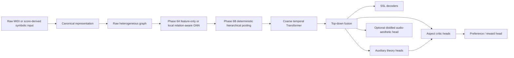

# Music Critic V2 Architecture

Status: **INCREMENTAL**. Phase 6A implements raw feature and local-GNN
representations; Phase 6B implements deterministic hierarchy, coarse
Transformer context, and top-down fusion. SSL and critic paths below remain
future phases.

## System flow


```mermaid
flowchart LR
    A[Raw MIDI or score-derived symbolic input] --> B[Canonical representation]
    B --> C[Raw heterogeneous graph]
    C --> D[Phase 6A feature-only or local relation-aware GNN]
    D --> E[Phase 6B deterministic hierarchical pooling]
    E --> F[Coarse temporal Transformer]
    F --> G[Top-down fusion]
    G --> H[SSL decoders]
    G --> I[Auxiliary theory heads]
    G --> J[Aspect critic heads]
    I --> J
    J --> K[Preference / reward head]
    G --> L[Optional distilled audio-aesthetic head]
```

Predicted theory distributions may feed later critic heads only through a path
that is available and trained consistently at inference. Gold labels must never
be substituted for predictions in the deployable path.

## Raw symbolic inputs

Ordinary unlabeled MIDI is a valid mandatory inference input. Safe observations
include pitch, onset, duration, velocity, channel/program metadata, percussion
flags, tempo and meter events, track membership, and deterministic statistics.

Optional score metadata must carry availability information and be droppable.
Theory annotations are auxiliary targets rather than required encoder inputs.

Production inference is role-agnostic: melody, accompaniment, bass, chord,
voice, and staff labels are not mandatory encoder inputs. Future training and
evaluation must test track permutation/merging, metadata removal, single-track
polyphony, multitrack inputs, and unreliable or absent metadata. Track roles
may be predicted as auxiliary targets.

## Harmonic supervision and quality boundary

The accepted cross-dataset contract is specified in
[`HARMONIC_SUPERVISION.md`](HARMONIC_SUPERVISION.md). The safe shared paths are:

```text
HookTheory melody-only raw graph -> shared encoder -> harmonic predictions
POP909-CL channel-0 combined-score raw graph -> shared encoder -> harmonic predictions
```

HookTheory chord annotations and POP909-CL channel-1 chord blocks are
target-only auxiliary harmonic supervision. Direct annotations may produce
derived harmonic targets such as root, quality, pitch-class set,
bass, inversion, boundary/span, and no-chord under dataset-specific availability
masks and annotation views. Bass and inversion are separate target families
with independent masks; a joint or factorized head is a future ablation. A
derivation is safe while it remains target-only. Target-derived notes or blocks
must not affect raw canonical content, graph features/topology, raw-input
serialization, graph serialization, raw-input cache identity, graph
fingerprints, or inference.

Derived targets may be serialized in separate target, annotation, or diagnostic
artifacts with provenance. Such artifacts remain outside raw-input/graph
serialization and identity and are not production inference input.

The architecture keeps four questions separate: harmonic-semantic recognition,
melody-conditioned harmonization, likelihood of actual performed/score notes
and voicing, and preference/quality assessment. A target-only diagnostic
rendering is not actual accompaniment. Chord classifier confidence and SSL
reconstruction loss are not quality scores.

A probabilistic masked-note/pitch-set decoder and deterministic
pseudo-log-likelihood protocol are future design-and-ablation work. They are
separate from representation reconstruction and from the future
preference/quality critic.

Phases 7–8 validate SSL mechanics on bounded pre-PDMX data. Phase 10 adds the
PDMX raw-compatible projection and must enable a full-scale rerun/evaluation of
the accepted Phase 7–8 objectives before scaled SSL or later adaptive-objective
claims.

## Diagnostic export boundary

`music_critic.exporters` is an output-only sibling of `music_critic.adapters`.
Adapters convert external data into validated canonical records; exporters
convert validated canonical records into diagnostic external artifacts. The
canonical MIDI exporter may depend on `mido`, but `music_critic.data` does not
import the exporter or `mido`, and graph/model/training paths do not depend on
rendering. HookTheory-specific selection remains in scripts rather than the
generic exporter.

Rendered MIDI is a consistency view of `CanonicalPiece`, not independent source
truth. Independent source checks use a separate audit script and are never
imported by production code.

## Mandatory raw-inference graph levels

- `song`
- `track`
- `bar`
- `beat`
- `onset`
- `note`

Every mandatory node and edge must be reproducible from raw symbolic evidence.
The base graph must not require gold harmonic spans, phrases, cadences, tonal
regions, or semantic track roles.

## Phase 3A raw heterograph contract

The public builder is `music_critic.graph.build_raw_graph`. It returns PyG
`HeteroData` with canonical schema, graph schema, feature registry, and builder
versions on every graph. Graph schema `1.0.0`, feature registry `1.0.0`, and
builder `1.0.0` define the initial contract.

Node order is always `song`, `track`, `bar`, `beat`, `onset`, `note`. Onsets
are the sorted unique exact `RationalTime` values of note starts. Every beat and
onset is a raw candidate slot for later direct theory heads. Candidate slots
contain no label, boundary, class, confidence, or target availability value.

Containment uses exact half-open intervals. A note belongs to the track in its
canonical record and to the bar containing its onset. An onset belongs to the
bar and beat containing its exact time; an event at the terminal piece boundary
is owned by the final interval. Notes are not split when they sustain across a
bar, meter, or tempo boundary.

Mandatory forward relations and their explicit reverses are:

```text
song contains_track track       <-> track belongs_to_song song
song contains_bar bar           <-> bar belongs_to_song song
track contains_note note        <-> note belongs_to_track track
bar contains_beat beat          <-> beat belongs_to_bar bar
bar contains_onset onset        <-> onset belongs_to_bar bar
bar contains_note note          <-> note belongs_to_bar bar
beat contains_onset onset       <-> onset belongs_to_beat beat
onset starts_note note          <-> note in_onset onset
bar next_bar bar                <-> bar previous_bar bar
beat next_beat beat             <-> beat previous_beat beat
onset next_onset onset          <-> onset previous_onset onset
note next_in_track note         <-> note previous_in_track note
note active_at beat             <-> beat has_active_note note
```

Temporal relations follow canonical chronological order. `next_in_track`
follows canonical note order within each track, including its deterministic
pitch/duration/ID tie-breaks for equal onsets. For a positive-duration note,
`active_at` connects to every canonical beat whose start lies in the exact
half-open note interval `[onset, offset)`. Grace notes create no sustained edge.
This distinguishes starting incidence from sustained activity without creating
simultaneous-note cliques. Cross-track vertical context flows through onset and
beat nodes. Construction is output-sensitive: indexing is
`O((N + O) log B + E_active + E_graph)`, where sustained-note incidence may
itself be large for notes spanning many beats, but dense same-onset polyphony
does not create pairwise note cliques.

Model-facing inputs are separate `x_cat`, `x_cont`, `x_cat_available`, and
`x_cont_available` tensors whose columns are declared by the feature registry.
Only raw MIDI-observable or deterministic raw-derived fields are registered.
Canonical targets, target-alignment or theory annotations, dataset/source-group
identity, split, source path, provenance, confidence, and quality flags are not
read when features or topology are built. Semantic nodes are not part of graph
schema `1.0.0`.

`validate_raw_graph` defines exact global, node-store, and edge-store attribute
allowlists. Extra attributes, including labels, theory, split, provenance, and
edge labels, invalidate the graph; deterministic serialization and
fingerprinting validate first and therefore fail rather than silently omitting
them. Unavailable categorical values use a dedicated, non-colliding unknown ID
when the feature declares one, and unavailable continuous values use the
canonical `0.0` placeholder under a false availability mask. Known categorical
values outside their declared vocabulary are rejected.

`build_raw_graph` validates the complete `CanonicalPiece` by default, including
ordering and references. `assume_valid=True` is an explicit fast path only for
callers that have already obtained an error-free canonical validation report;
behavior on invalid input through that path is outside the contract. Structural
ownership and activity calculations use exact rational time. Continuous timing
is converted to `float32` only at feature-tensor construction, so feature
precision is lower than canonical structural precision.

PyTorch and PyG imports remain isolated to `music_critic.graph` and the
Phase 5B.1 `music_critic.tasks` tensor/collator boundary, while the current
package dependency declaration installs them globally. Graph schema `1.0.0`
does not define caching metadata or semantic prediction stores, and
sustained-note output is necessarily proportional to emitted note/beat
incidence.

## Phase 5A/5B.1 target-sidecar and collation architecture

Target ontology `1.0.1` is implemented in `music_critic.tasks` and specified by
`MULTISOURCE_TARGET_CONTRACT.md`. It inventories 12 HookTheory and six
POP909-CL source-native families. No current cross-source pair is declared
exact or accepted as a lossless derived subset.

`prepare_multisource_sample` builds the Phase 3A graph from the validated
canonical piece and stores a complete graph fingerprint in the immutable
`MultiSourceSample` sidecar. The external-graph factory proves equality to a
fresh canonical projection and exposes no verification bypass. The collator
recomputes the fingerprint to reject feature or topology mutation after
preparation. Graph-free `MultiSourceTargetProjection` is used only for target
inventory audits. No binding is stored in PyG.

Phase 5B.1 implements indexed exact alignment, target encoding registry
`1.0.0`, tensorization, and production collation. The PyG batch remains
raw-only; target values and alignment indices never enter graph global, node,
or edge stores. A batch-aware validator adapts
the exact Phase 3A allowlists to normal PyG collation: only node-level `batch`
and `ptr` are additionally allowed, version/raw-only metadata is checked per
source graph, and combined shapes, offsets, endpoints, and reconstructed
graphs must remain valid. Local target indices become typed global indices
through PyG `ptr` and are checked against the typed `batch` vector. HookTheory
retains melody-conditioned supervision, POP909-CL retains score-conditioned
recognition, and raw MIDI may have an entirely empty target bundle.

One immutable per-piece `AlignmentIndex` provides O(1) note/annotation and
exact-time mappings plus sorted rational onset/beat/bar candidates. Half-open
span lookup uses bisect. Because index construction sorts temporal candidates,
strict alignment complexity is `O(P + C log C + T log C + R + F*C)`, where
fixed-registry `F*C` is linear in candidate count; no source-entry loop repeats
complete index construction or candidate scans. Alignment policies remain
task-declarative and exact: note identity; half-open containment of onset
points and beat/bar start anchors; exact span-start boundary events; and
explicitly available coverage spans. Every aligned index has an explicit node
type. Equal multi-span values merge, conflicts are masked with a stable
diagnostic, and unmatched boundary events are retained with a masked index
rather than snapped. POP909-CL boundary event detection and no-chord coverage
detection are distinct positive-unlabeled tasks. The former defines no
synthetic `absent`; the latter has only explicit positive `N` spans and defines
no synthetic `not_N` from chord spans, uncovered candidates, or absent
annotations. Masked, absent, ambiguous, unsupported, trailing-uncovered, and
available no-chord states remain distinct.

Grouping resolves authoritative lineage from provenance, using the canonical
source group only as an explicit fallback. Any override is an equality
assertion. Ordering operates on atomic transitive components connected by
source or lineage and is seeded and input-order invariant. Split safety is
checked on those same transitive components, including paths bridged by an
unassigned `split=None` record, and every dataset piece has one assignment.

Closed categorical sidecars use ontology-order `torch.long` indices with
masked sentinel `-1`; closed multilabel sidecars use `torch.bool [N, C]`.
Open strings remain lossless CPU tuples and are explicitly not model-ready.
Encoding metadata selects only a value representation, not a loss.
`supervision_regime` distinguishes fully supervised, positive-unlabeled, and
deferred open-vocabulary semantics. Source availability, successful entity
alignment, and model readiness jointly define future supervision eligibility.
Eligibility only routes a row to a future task-specific objective; it does not
turn either PU task into fully-supervised classification. Concrete losses are
Phase 6 decisions.
Deterministic CPU statistics distinguish model-encodable from
supervision-eligible rows and separately count masked, unaligned, conflict,
and deferred rows.

## Phase 5B.2 corpus and loading architecture

Phase 5B.2 adds versioned portable corpus index/cache contracts without
changing canonical, graph, adapter, ontology, or encoding semantics. Offline
HookTheory and POP909-CL builders serialize one deterministic canonical JSON
artifact per accepted source. Cache identity binds source content,
adapter/config, canonical schema, ontology semantics, and cache version;
artifact identity additionally binds canonical payload SHA-256. Cache writes
are atomic, partial files are invalid, and stale namespaces are retained.
Graphs and tensors are never cached.

`IndexedMultiSourceDataset` loads index metadata only. Each item reads and
verifies exactly one artifact, validates it, and invokes
`prepare_multisource_sample`. Canonical source grouping, prepared
dataset/piece/source/lineage identity, and recomputed target availability must
equal the freshly fingerprinted index sidecars or loading fails closed. None
of those sidecars enter graph stores. A pickle restoration path reinstates the
private canonical/raw binding token and revalidates the graph fingerprint, so
spawn workers do not weaken Phase 5B.1.

Splits are external versioned `SplitManifest` values bound to the exact
complete constituent index set and transitive source/lineage component
fingerprints across corpus boundaries. `MultiCorpusDataset` validates one
global manifest against all indices before deriving any view; separately
validated per-corpus manifests cannot be composed. Every derived view binds
manifest, split, its corpus index, and exact ordered record membership.
Source-provided split is only `suggested_split`; no Dataset applies it
implicitly. The optional group-hash planner is target-blind and requires
explicit fixture/user seed and ratios. No production split is selected in
this phase.

`MultiCorpusDataset` composes one globally validated split in stable dataset-ID
order. Its versioned composition fingerprint commits to the global manifest,
constituent indices, and ordered membership of every view.
The quota sampler uses explicit positive weights, largest-remainder epoch
quotas, and local torch generators for dataset schedules and shuffled local
cycles. Epoch evidence carries the composition identity, and the schedule
fingerprint hashes resolved `(dataset_id, piece_id)` identities plus sampler
version, seed, epoch, weights, and quotas rather than transient global
offsets. Epoch replay is deterministic and target-independent. The DataLoader
factory uses the existing Phase 5B.1 collator and top-level Python/torch worker
seeding. Worker parity covers complete raw graphs and all target/CPU sidecars
and deterministic statistics. HookTheory corpus building quarantines only
`HookTheoryAdapterError`; unexpected failures abort without publishing a
successful index/report. All cache, split, sampling, and worker diagnostics
remain CPU-side; models and losses remain outside Phase 5B.2.

## Optional semantic predictions

The system may predict:

- harmony;
- local key or tonal region;
- phrase and section boundaries;
- cadence;
- track role;
- scale degree;
- Roman numeral;
- non-chord-tone type.

These are candidate-slot or direct-head outputs. Gold semantic nodes may exist
for supervision or analysis, but cannot be required by raw inference.

## Representation hierarchy

1. Phase 6A encodes every raw feature store and optionally applies a shallow
   relation-specific local heterogeneous GNN over every Phase 3A relation.
   Its versioned output retains feature-scale, optional per-layer, and final
   one-row-per-node representations plus batch membership. Source-native heads
   emit logits for every allowed raw candidate before targets are joined for
   loss; raw-only inference therefore uses the same candidate path. Target
   replacement, deletion, masking, or addition cannot change candidate
   identity or eval logits. No head is global-mean-only.
2. Phase 6B validates exact ownership from raw forward/reverse hierarchy edges.
   Sparse family pooling produces bar tokens from own+beat+onset+note evidence
   and track tokens from own+note evidence. Mean, maximum, log-count, explicit
   availability, learned projection, and parent residual are retained without
   a dense membership matrix or child-by-parent tensor.
   Store existence and `edge_index` presence are checked before PyG indexing,
   so structured failures cannot create missing stores. Externally supplied
   ownership is compared exactly with raw relations and local membership; the
   standard model path scans raw ownership once.
3. One padded sequence per sample is `[SONG] + bars + tracks`, with separate
   type embeddings, runtime ordinal positions, and a key-padding mask. A
   batch-first pre-norm Transformer returns contextual song/bar/track rows
   without cross-sample attention. The SONG row is a representation, not a
   quality score. Counts, family ordinals, and positions are tensorized; coarse
   packing has no per-row host synchronization and performs one batch-level
   synchronization only to allocate `max(L_s)` padding.
4. Gated top-down residual fusion returns contextual bar+track+song to notes,
   bar+song to onsets/beats, contextual parent+song to bars/tracks, and
   contextual song to song while retaining all local rows.
5. Separate heads perform SSL reconstruction, theory prediction, aspect
   scoring, pairwise preference, and optional aesthetic distillation.

Missing supervised targets always use explicit masks. A missing label is never
interpreted as a negative example.

Phase 6A implements only visible-input local reconstruction as a plumbing
check and fully supervised auxiliary semantics. Phase 6B adds global context
without changing that reconstruction or using mean-only final aggregation.
GraphMAE2-style masking begins in Phase 7; future critic evidence must retain
local or top-k worst regions.

Phase 6A model/output and loss contracts are `1.1.0`; candidate prediction is
`1.0.0`. Tensor node-type codes in `BatchTarget` contract `1.1.0` permit the
candidate join and task/node-type/sample reductions to stay tensorized, with
Python work bounded by the fixed task/node-family registry. Checkpoints
`1.1.0` validate metadata and complete model/optimizer structure before an
atomic state application; saves use atomic same-directory replacement.
Canonical one-note sensitivity rebuilds and validates both graphs. Its
oversmoothing statistic is separate per sample/node type/scale, unavailable
below two nodes, and exact linear `O(ND)`.

Phase 6B pooling, coarse-sequence, hierarchical-output, top-down-fusion,
hierarchical-model/output, and hierarchical-checkpoint contracts are each
`1.0.0`. Phase 6A versions remain unchanged. The full additive contract is in
`PHASE6B_HIERARCHY.md`.

## Incremental research scope

GraphMAE2-inspired decoder remasking, Hi-GMAE-inspired hierarchical masking, and
UGMAE-inspired adaptive or structural objectives are roadmap increments. They
are not all part of the bootstrap or the first baseline model.
